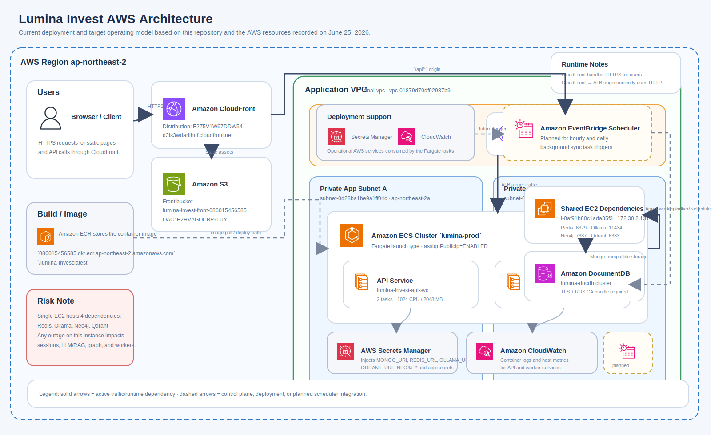

# Lumina Invest AWS Work

`lumina-invest`의 AWS 포팅 및 운영 정보를 정리한 단일 문서입니다.  
이 문서는 기존 `README.md`와 `readme2.md`를 합친 기준 문서이며, 실제 리소스 값과 운영 메모를 함께 담고 있습니다.

## Ansible IaC

`aws-work/ansible` 아래에 현재 운영값을 기준으로 한 Ansible IaC 프로젝트를 추가했습니다.

- 실행 진입점: `aws-work/ansible/playbooks/site.yml`
- 인벤토리: `aws-work/ansible/inventories/prod/group_vars/all.yml`
- 시크릿 샘플: `aws-work/ansible/inventories/prod/group_vars/secrets.sample.yml`
- 생성 결과물: `aws-work/ansible/build/`

설계 원칙:

- 현재 문서에 없는 Route Table / NAT 상세는 추정하지 않고, 기존 `VPC/Subnet/SG`를 입력값으로 참조합니다.
- ECS, IAM, S3, Secrets Manager, ALB, CloudWatch Logs는 Ansible 모듈 기준으로 관리합니다.
- CloudFront OAC, Scheduler payload는 Ansible이 JSON artifact를 렌더링하고, 실제 적용은 명시적으로 켜는 방식으로 분리했습니다.

빠른 사용 예시:

```bash
cd aws-work/ansible
ansible-galaxy collection install -r collections/requirements.yml
# inventories/prod/group_vars/secrets.yml 의 placeholder 값을 실제 값으로 수정
# inventories/prod/group_vars/all.yml 의 ALB 두 번째 public subnet ID도 수정
ansible-playbook playbooks/site.yml
```

아키텍처 다이어그램:




---

## 현재 배포 상태

> Account: `086015456585`  
> Region: `ap-northeast-2`  
> 홈페이지: `https://d3ls3wdarllhnf.cloudfront.net`

| 리소스 | ID / 값 | 상태 |
|--------|---------|------|
| VPC | `vpc-01879d70df92987b9` (final-vpc, `172.30.0.0/16`) | ✅ |
| ECS Cluster | `lumina-prod` | ✅ |
| ECS API Service | `lumina-invest-api-svc` — task-def rev 2, 2/2 running | ✅ |
| ECS Worker Service | `lumina-invest-worker-svc` — task-def rev 2, 1/1 running | ✅ |
| ALB | `lumina-alb` → `lumina-alb-1822566663.ap-northeast-2.elb.amazonaws.com` | ✅ |
| ALB Target | `172.30.139.251` / `172.30.37.124` — healthy | ✅ |
| CloudFront | `E2Z5V1W67DDW54` → `d3ls3wdarllhnf.cloudfront.net` | ✅ |
| S3 Front Bucket | `lumina-invest-front-086015456585` | ✅ |
| OAC | `E2HVAGOCBF9LUY` (`lumina-invest-oac`) | ✅ |
| DocumentDB | `lumina-docdb.cluster-cg0ugoglztrn.ap-northeast-2.docdb.amazonaws.com:27017` | ✅ |
| EC2 의존 서비스 호스트 | `i-0af91b80c1ada35f3` (`172.30.2.131`, `t3.medium`) | ✅ |
| ECR | `086015456585.dkr.ecr.ap-northeast-2.amazonaws.com/lumina-invest:latest` | ✅ |
| Secrets Manager | `lumina-invest/prod/app` (`-c4WE2y`) | ✅ |
| IAM Exec Role | `ecsTaskExecutionRole` + `SecretsManagerReadAccess` | ✅ |
| IAM Task Role | `luminaInvestTaskRole` | ✅ |
| IAM Scheduler Role | `luminaSchedulerRole` | ✅ |

### 추가 리소스

| 리소스 | 값 | 상태 |
|--------|----|------|
| Auth API Gateway | `lumina-auth-api` (`6ow1q0ivg8`) | ✅ |
| Crawl API Gateway | `lumina-crawl-api` (`uzsod90nkd`) | ✅ |
| Auth Lambda | `lumina-auth-service` | ✅ |
| Crawl Lambda | `lumina-crawl-service` | ✅ |
| Slack Notify Lambda | `lumina-slack-notify` | ✅ |
| CodePipeline | `lumina-invest-pipeline` | ✅ |
| CodeBuild | `lumina-build` | ✅ |

### 남은 작업

| 항목 | 내용 |
|------|------|
| ⏳ DocDB 비밀번호 | Secrets Manager `MONGO_URI`의 `docdbuser` 비밀번호를 실제 값으로 교체 필요 |
| ⏳ EventBridge Scheduler | hourly/daily ECS 스케줄 아직 미생성 |

---

## 아키텍처 개요

### 현재 핵심 런타임 경로

```text
사용자 (HTTPS)
  ↓
CloudFront  d3ls3wdarllhnf.cloudfront.net
  ├─ /api/auth/*   → API Gateway lumina-auth-api   → Lambda lumina-auth-service
  ├─ /api/ingest/* → API Gateway lumina-crawl-api  → Lambda lumina-crawl-service
  ├─ /api/*        → ALB lumina-alb                → ECS lumina-invest-api-svc
  └─ /*            → S3 lumina-invest-front-086015456585

ECS lumina-prod
  ├─ lumina-invest-api-svc
  └─ lumina-invest-worker-svc
       ↓
EC2 i-0af91b80c1ada35f3 (172.30.2.131)
  ├─ Redis  :6379
  ├─ Ollama :11434
  ├─ Neo4j  :7687
  └─ Qdrant :6333
       ↓
DocumentDB lumina-docdb :27017
```

> 주의: Redis, Ollama, Neo4j, Qdrant가 EC2 1대에 몰려 있어 단일 장애점입니다.

---

## 네트워크

| 항목 | 값 |
|------|----|
| VPC ID | `vpc-01879d70df92987b9` |
| CIDR | `172.30.0.0/16` |

### 서브넷

| 이름 | ID | AZ | CIDR | 공개 여부 |
|------|----|----|------|-----------|
| subnet-test-a | `subnet-0d28ba1be9a1ff04c` | `ap-northeast-2a` | `172.30.128.0/17` | Private |
| subnet-test-b | `subnet-0e0cd6292f59623af` | `ap-northeast-2b` | `172.30.32.0/19` | Private |
| subnet-test-c | `subnet-0b7dcd7ba9c6836c0` | `ap-northeast-2c` | `172.30.2.0/24` | Public |
| subnet-test-d | `subnet-084bfb82b09ef14e1` | `ap-northeast-2d` | `172.30.64.0/18` | Private |

### Security Group

| SG | ID | 허용 규칙 |
|----|----|-----------|
| lumina-alb-sg | `sg-0cab122da7c919d78` | `0.0.0.0/0 -> TCP 80` |
| lumina-ecs-sg | `sg-0baee9bc5a2ea90b0` | `lumina-alb-sg -> TCP 8000` |
| lumina-docdb-sg | `sg-02cd84bcccf1eb18f` | `lumina-ecs-sg -> TCP 27017` |
| launch-wizard-1 | `sg-0dc3ec23151b1ce26` | `lumina-ecs-sg -> TCP 6379/11434/6333/7687` |

---

## 컴퓨팅

### ECS Fargate

| 서비스명 | Task Definition | Desired | Running | 역할 |
|----------|----------------|---------|---------|------|
| `lumina-invest-api-svc` | `lumina-invest-api:3` | 2 | 2 | FastAPI 코어 API 서버 |
| `lumina-invest-worker-svc` | `lumina-invest-worker:2` | 1 | 1 | Celery 비동기 워커 |

### ECS API 주요 환경변수

| 변수 | 값 |
|------|----|
| `MONGO_DB` | `fin_agent` |
| `TRUST_PROXY` | `true` |
| `COOKIE_SECURE` | `false` |
| `REDIS_URL` | `redis://172.30.2.131:6379` |
| `MONGO_URI` | DocumentDB (TLS) |

### Lambda

| 함수명 | 런타임 | 메모리 | 타임아웃 | 역할 |
|--------|--------|--------|---------|------|
| `lumina-auth-service` | Container Image (Python 3.12) | 512 MB | 30s | 회원가입/로그인/로그아웃/세션 |
| `lumina-crawl-service` | Container Image (Python 3.12) | 1024 MB | 300s | 크롤링/문서 인제스트/금융 데이터 |
| `lumina-slack-notify` | Python 3.12 | 128 MB | 10s | Slack 배포 알림 |

### Lambda 공통 설정

- VPC: `vpc-01879d70df92987b9`
- 서브넷: `subnet-0d28ba1be9a1ff04c`, `subnet-0e0cd6292f59623af`
- 보안 그룹: `sg-0baee9bc5a2ea90b0`
- ASGI 어댑터: `Mangum`
- RDS CA: `/etc/pki/ca-trust/source/anchors/rds-global-bundle.pem`

### EC2

| 항목 | 값 |
|------|----|
| Instance ID | `i-0af91b80c1ada35f3` |
| Name | `bastion-host` |
| Type | `t3.medium` |
| Public IP | `3.34.124.168` |
| Private IP | `172.30.2.131` |
| OS | Amazon Linux 2023 |
| Data Path | `/data/lumina-invest` |

### EC2 네이티브 서비스

| 서비스 | 포트 | 상태 |
|--------|------|------|
| Redis 6 | 6379 | systemd |
| Neo4j | 7687 / 7474 | systemd |
| Ollama | 11434 | systemd |
| Qdrant | 6333 | optional container/native |

### Ollama 모델

| 용도 | 모델 |
|------|------|
| 채팅 / 추론 | `llama3.1` |
| 임베딩 | `nomic-embed-text` |
| Vision | `llava` |

---

## 로드밸런서 / CDN / API

### ALB

| 항목 | 값 |
|------|----|
| 이름 | `lumina-alb` |
| DNS | `lumina-alb-1822566663.ap-northeast-2.elb.amazonaws.com` |
| 타입 | Application Load Balancer |

### ALB 리스너 규칙 (80)

| Priority | 경로 패턴 | 타겟 그룹 | 타겟 타입 |
|----------|-----------|-----------|-----------|
| 10 | `/api/auth/*`, `/api/me`, `/api/sessions`, `/api/sessions/*` | `lumina-auth-lambda-tg` | Lambda |
| default | `*` | `lumina-api-tg` | ip (ECS 8000) |

### CloudFront

| 항목 | 값 |
|------|----|
| Distribution ID | `E2Z5V1W67DDW54` |
| 도메인 | `https://d3ls3wdarllhnf.cloudfront.net` |

### CloudFront Origins

| Origin ID | 도메인 | 용도 |
|-----------|--------|------|
| `apigw-auth` | `6ow1q0ivg8.execute-api.ap-northeast-2.amazonaws.com` | Auth API |
| `apigw-crawl` | `uzsod90nkd.execute-api.ap-northeast-2.amazonaws.com` | Crawl API |
| `alb-api` | `lumina-alb-1822566663.ap-northeast-2.elb.amazonaws.com` | ECS 코어 API |
| `s3-front` | `lumina-invest-front-086015456585.s3.ap-northeast-2.amazonaws.com` | 정적 프론트 |

### CloudFront Cache Behavior

| Path Pattern | Origin | 용도 |
|-------------|--------|------|
| `/api/auth/*` | `apigw-auth` | 인증 서비스 |
| `/api/ingest/*` | `apigw-crawl` | 크롤링 서비스 |
| `/api/*` | `alb-api` | 코어 API |
| `/*` | `s3-front` | 프론트엔드 |

### API Gateway

| 이름 | ID | 프로토콜 | 엔드포인트 | 연결 Lambda |
|------|----|---------|-----------|------------|
| `lumina-auth-api` | `6ow1q0ivg8` | HTTP | `https://6ow1q0ivg8.execute-api.ap-northeast-2.amazonaws.com` | `lumina-auth-service` |
| `lumina-crawl-api` | `uzsod90nkd` | HTTP | `https://uzsod90nkd.execute-api.ap-northeast-2.amazonaws.com` | `lumina-crawl-service` |

---

## 컨테이너 레지스트리

| 리포지토리 | 용도 | 빌드 옵션 |
|------------|------|-----------|
| `lumina-invest` | ECS 코어 서비스 | `--platform linux/amd64 --provenance=false` |
| `auth-service` | Lambda auth | `--platform linux/amd64 --provenance=false` |
| `crawl-service` | Lambda crawl | `--platform linux/amd64 --provenance=false` |

> Lambda는 멀티플랫폼 manifest list를 제대로 처리하지 못하므로 `--provenance=false`를 사용합니다.

---

## 데이터 저장소

### DocumentDB

| 항목 | 값 |
|------|----|
| Cluster ID | `lumina-docdb` |
| Endpoint | `lumina-docdb.cluster-cg0ugoglztrn.ap-northeast-2.docdb.amazonaws.com:27017` |
| Engine | DocDB (MongoDB 4.x 호환) |
| DB명 | `fin_agent` |
| TLS | 필수 (`tlsCAFile` = RDS Global Bundle) |
| 보안 그룹 | `lumina-docdb-sg` |

### Redis

| 항목 | 값 |
|------|----|
| 호스트 | `172.30.2.131:6379` |
| 패키지 | `redis6` |
| 용도 | 세션 캐시, Celery Broker |

### Neo4j

| 항목 | 값 |
|------|----|
| 호스트 | `bolt://172.30.2.131:7687` |
| HTTP 콘솔 | `http://172.30.2.131:7474` |
| 용도 | GraphRAG |

### Qdrant

| 항목 | 값 |
|------|----|
| 호스트 | `http://172.30.2.131:6333` |
| Collection | `fin_chunks` |
| 용도 | RAG 벡터 검색 |

---

## 스토리지

| 버킷명 | 용도 |
|--------|------|
| `lumina-invest-front-086015456585` | 프론트엔드 정적 파일 |
| `lumina-source-086015456585` | CodePipeline 소스 |
| `lumina-pipeline-artifacts-086015456585` | CodePipeline 아티팩트 |

---

## CI/CD

### CodePipeline

| 항목 | 값 |
|------|----|
| 이름 | `lumina-invest-pipeline` |
| 소스 | S3 `lumina-source-086015456585/source.zip` |
| 빌드 | CodeBuild `lumina-build` |

### CodeBuild `buildspec.yml` 흐름

```text
1. ECR 로그인
2. auth-service Docker 빌드 & 푸시
3. crawl-service Docker 빌드 & 푸시
4. lumina-invest Docker 빌드 & 푸시
5. Lambda update-function-code (auth, crawl)
6. ECS update-service --force-new-deployment (api, worker)
```

### 배포 트리거

```bash
ssh -i ai-agent.pem ec2-user@3.34.124.168 "bash /data/deploy.sh"
```

`/data/deploy.sh`:

```text
1. /data/lumina-invest → /tmp/lumina-source.zip 압축
2. S3 source.zip 업로드
3. CodePipeline이 변경 감지 후 빌드 시작
```

---

## 이벤트 / 스케줄 / 알림

### EventBridge

| Rule 이름 | 트리거 | 타겟 | 용도 |
|-----------|--------|------|------|
| `lumina-pipeline-every-5min` | `rate(5 minutes)` | `lumina-invest-pipeline` | 파이프라인 주기 실행 |
| `lumina-pipeline-state-change` | CodePipeline 상태변경 | `lumina-slack-notify` | Slack 배포 알림 |

### 파이프라인 상태변경 이벤트 패턴

```json
{
  "source": ["aws.codepipeline"],
  "detail-type": ["CodePipeline Pipeline Execution State Change"],
  "detail": {
    "pipeline": ["lumina-invest-pipeline"],
    "state": ["SUCCEEDED", "FAILED", "STARTED"]
  }
}
```

### Slack 알림

| 항목 | 값 |
|------|----|
| Lambda | `lumina-slack-notify` |
| 트리거 | `lumina-pipeline-state-change` |
| 포함 정보 | 배포 상태, 홈페이지 링크, CodePipeline 콘솔 링크 |

### 예정된 ECS Scheduler

`README` 기준 남은 작업:

- `lumina-hourly-sync`
- `lumina-daily-candles`

---

## IAM / Secret

### IAM 역할

| 역할 | ARN / 용도 |
|------|------------|
| `ecsTaskExecutionRole` | ECS 실행 역할 + `AmazonECSTaskExecutionRolePolicy` + `SecretsManagerReadAccess` |
| `luminaInvestTaskRole` | ECS 애플리케이션 역할 |
| `luminaSchedulerRole` | EventBridge Scheduler의 ECS 실행 역할 |
| `lumina-lambda-exec-role` | Lambda VPC / 로그 실행 |
| `lumina-lambda-role` | Slack Lambda 실행 |
| `lumina-codebuild-role` | ECR push, Lambda/ECS 배포 |
| `lumina-codepipeline-role` | S3, CodeBuild 연동 |
| `lumina-ec2-ssm-role` | EC2 SSM / S3 업로드 |
| `lumina-events-pipeline-role` | EventBridge의 `StartPipelineExecution` |

### Secrets Manager

| Secret 이름 | ARN | 용도 |
|-------------|-----|------|
| `lumina-invest/prod/app` | `arn:aws:secretsmanager:ap-northeast-2:086015456585:secret:lumina-invest/prod/app-c4WE2y` | DB 자격증명, JWT 시크릿, 연결 URL |

---

## 요청 라우팅 흐름

### 로그인

```text
브라우저
  -> CloudFront (/api/auth/*)
  -> API Gateway lumina-auth-api
  -> Lambda lumina-auth-service
  -> DocumentDB / Redis
```

### 채팅 / AI

```text
브라우저
  -> CloudFront (/api/*)
  -> ALB
  -> ECS lumina-invest-api-svc
  -> Ollama / Qdrant / Neo4j
```

### 크롤링

```text
브라우저
  -> CloudFront (/api/ingest/*)
  -> API Gateway lumina-crawl-api
  -> Lambda lumina-crawl-service
  -> DocumentDB
```

### Celery 비동기 태스크

```text
ECS api-svc -> Redis Broker -> ECS worker-svc -> DocumentDB / Qdrant / Neo4j
```

---

## 공통 변수

```bash
export REGION=ap-northeast-2
export ACCOUNT_ID=086015456585

export APP_NAME=lumina-invest
export CLUSTER_NAME=lumina-prod
export ECR_REPO=lumina-invest
export ECS_EXEC_ROLE=ecsTaskExecutionRole
export ECS_TASK_ROLE=luminaInvestTaskRole
export SCHED_ROLE=luminaSchedulerRole

export VPC_ID=vpc-01879d70df92987b9
export PUB_SUBNET_1=subnet-0b7dcd7ba9c6836c0
export PRI_SUBNET_1=subnet-0d28ba1be9a1ff04c
export PRI_SUBNET_2=subnet-0e0cd6292f59623af

export ALB_SG=sg-0cab122da7c919d78
export ECS_SG=sg-0baee9bc5a2ea90b0
export DOCDB_SG=sg-02cd84bcccf1eb18f
export EC2_SG=sg-0dc3ec23151b1ce26

export INSTANCE_ID=i-0af91b80c1ada35f3
export INSTANCE_PRIVATE_IP=172.30.2.131

export FRONT_BUCKET=lumina-invest-front-${ACCOUNT_ID}
export OAC_ID=E2HVAGOCBF9LUY
export CF_ID=E2Z5V1W67DDW54
export CF_DOMAIN=d3ls3wdarllhnf.cloudfront.net

export DOCDB_ENDPOINT=lumina-docdb.cluster-cg0ugoglztrn.ap-northeast-2.docdb.amazonaws.com
export DOCDB_SUBNET_GROUP=lumina-docdb-subnet-group
export DOCDB_CLUSTER=lumina-docdb

export ALB_ARN=arn:aws:elasticloadbalancing:${REGION}:${ACCOUNT_ID}:loadbalancer/app/lumina-alb/2766a63190a2b3a4
export TG_ARN=arn:aws:elasticloadbalancing:${REGION}:${ACCOUNT_ID}:targetgroup/lumina-api-tg/a8a20e4493ab33d9
export SECRET_ARN=arn:aws:secretsmanager:${REGION}:${ACCOUNT_ID}:secret:lumina-invest/prod/app-c4WE2y
```

---

## 파일 목록

| 파일 | 설명 | 상태 |
|------|------|------|
| `api-taskdef.json` | ECS API 태스크 정의 | ✅ |
| `worker-taskdef.json` | ECS Worker 태스크 정의 | ✅ |
| `scheduler-ecs-policy.json` | Scheduler → ECS 실행 권한 | ⏳ |
| `cf-distribution.json` | CloudFront 배포 설정 참조용 | ✅ |
| `ecs-tasks-trust-policy.json` | ECS 태스크 신뢰 정책 | ✅ |
| `scheduler-trust.json` | Scheduler 신뢰 정책 | ✅ |
| `app-secrets.sample.json` | Secrets Manager 샘플 | ✅ |
| `lumina-aws-architecture.svg` | AWS 아키텍처 다이어그램 | ✅ |

---

## 트러블슈팅 이력

| # | 증상 | 원인 | 해결 |
|---|------|------|------|
| 1 | CloudFront AccessDenied | S3 버킷 정책 없음 | OAC 기준 버킷 정책 추가 |
| 2 | ECS 503 / SM 연결 불가 | Private subnet에서 Secrets Manager 라우팅 없음 | `assignPublicIp=ENABLED` |
| 3 | AccessDeniedException (SM) | ECS execution role에 SM 권한 없음 | `SecretsManagerReadAccess` 추가 |
| 4 | `json key MONGO_URI` 없음 | Secret 키 누락 | `MONGO_URI` 추가 |
| 5 | Target.NotInUse | ECS subnet과 ALB 활성 AZ 불일치 | ECS subnet 교정 |
| 6 | DocDB SSL CERTIFICATE_VERIFY_FAILED | 컨테이너에 RDS CA 없음 | `rds-global-bundle` 포함 후 재배포 |
| 7 | DocDB Authentication failed | 비밀번호 미설정 | 실제 마스터 비밀번호로 교체 필요 |

---

## 배포 및 운영 절차

### 1. DocDB 비밀번호 업데이트

```bash
python3 - <<'EOF'
import subprocess, json, re

result = subprocess.run(
    ["aws", "secretsmanager", "get-secret-value",
     "--secret-id", "lumina-invest/prod/app",
     "--query", "SecretString", "--output", "text"],
    capture_output=True, text=True
)
secret = json.loads(result.stdout.strip())

ACTUAL_PASSWORD = "여기에실제비밀번호"
secret["MONGO_URI"] = re.sub(
    r'(mongodb://docdbuser:)[^@]+(@)',
    rf'\g<1>{ACTUAL_PASSWORD}\2',
    secret["MONGO_URI"]
)

subprocess.run(
    ["aws", "secretsmanager", "update-secret",
     "--secret-id", "lumina-invest/prod/app",
     "--secret-string", json.dumps(secret)],
    capture_output=True, text=True
)
print("완료")
EOF
```

### 2. ECS 서비스 재배포

```bash
aws ecs update-service --cluster lumina-prod \
  --service lumina-invest-api-svc --force-new-deployment \
  --region $REGION

aws ecs update-service --cluster lumina-prod \
  --service lumina-invest-worker-svc --force-new-deployment \
  --region $REGION
```

### 3. ECR 이미지 업데이트

```bash
aws ecr get-login-password --region $REGION | \
  docker login --username AWS --password-stdin ${ACCOUNT_ID}.dkr.ecr.${REGION}.amazonaws.com

docker build -t ${ECR_REPO}:latest /home/ubuntu/lumina-invest
docker tag ${ECR_REPO}:latest ${ACCOUNT_ID}.dkr.ecr.${REGION}.amazonaws.com/${ECR_REPO}:latest
docker push ${ACCOUNT_ID}.dkr.ecr.${REGION}.amazonaws.com/${ECR_REPO}:latest
```

### 4. ECS Task Definition 재등록

```bash
aws ecs register-task-definition \
  --cli-input-json file://aws-work/api-taskdef.json --region $REGION

aws ecs register-task-definition \
  --cli-input-json file://aws-work/worker-taskdef.json --region $REGION
```

### 5. Scheduler Role 정책 적용

```bash
aws iam put-role-policy \
  --role-name $SCHED_ROLE \
  --policy-name scheduler-ecs-run-task \
  --policy-document file://aws-work/scheduler-ecs-policy.json
```

### 6. EventBridge Scheduler 생성

```bash
aws scheduler create-schedule \
  --name lumina-hourly-sync \
  --schedule-expression "rate(1 hour)" \
  --flexible-time-window '{"Mode":"OFF"}' \
  --target "{
    \"Arn\":\"arn:aws:ecs:${REGION}:${ACCOUNT_ID}:cluster/${CLUSTER_NAME}\",
    \"RoleArn\":\"arn:aws:iam::${ACCOUNT_ID}:role/${SCHED_ROLE}\",
    \"EcsParameters\":{
      \"TaskDefinitionArn\":\"arn:aws:ecs:${REGION}:${ACCOUNT_ID}:task-definition/${APP_NAME}-worker\",
      \"LaunchType\":\"FARGATE\",
      \"NetworkConfiguration\":{
        \"awsvpcConfiguration\":{
          \"Subnets\":[\"${PRI_SUBNET_1}\",\"${PRI_SUBNET_2}\"],
          \"SecurityGroups\":[\"${ECS_SG}\"],
          \"AssignPublicIp\":\"ENABLED\"
        }
      }
    }
  }" \
  --region $REGION
```

### 7. 프론트 정적 파일 업로드

```bash
aws s3 sync /home/ubuntu/lumina-invest/public/ s3://$FRONT_BUCKET/ --delete
```

### 8. EC2 기반 파이프라인 트리거

```bash
rsync -az --exclude '.git' --exclude '__pycache__' \
  -e "ssh -i ai-agent.pem" \
  ./ ec2-user@3.34.124.168:/data/lumina-invest/

ssh -i ai-agent.pem ec2-user@3.34.124.168 "bash /data/deploy.sh"
```

### 9. 파이프라인 상태 확인

```bash
aws codepipeline get-pipeline-state \
  --name lumina-invest-pipeline \
  --region ap-northeast-2 \
  --query 'stageStates[*].{Stage:stageName,Status:latestExecution.status}' \
  --output table
```

### 10. 로그 확인

```bash
aws logs tail /ecs/lumina-invest-api --follow
```

---

## 서비스 접속 주소

| 서비스 | URL |
|--------|-----|
| 홈페이지 | `https://d3ls3wdarllhnf.cloudfront.net` |
| ALB 직접 접속 | `http://lumina-alb-1822566663.ap-northeast-2.elb.amazonaws.com` |
| Auth API GW | `https://6ow1q0ivg8.execute-api.ap-northeast-2.amazonaws.com` |
| Crawl API GW | `https://uzsod90nkd.execute-api.ap-northeast-2.amazonaws.com` |
| Neo4j 브라우저 | `http://172.30.2.131:7474` |
| Ollama | `http://172.30.2.131:11434` |
| Qdrant | `http://172.30.2.131:6333` |

---

## 운영 체크 포인트

- `app/main.py`의 인프로세스 스케줄러 `start_sync_scheduler()`는 EventBridge Scheduler와 중복될 수 있어 운영 전 비활성화 권장
- EC2 단일 장애점 모니터링 필요
- CloudFront → ALB 구간은 HTTP, 사용자 → CloudFront 구간은 HTTPS
- ECS / Lambda / EC2가 모두 DocumentDB 및 Redis 접근에 의존
