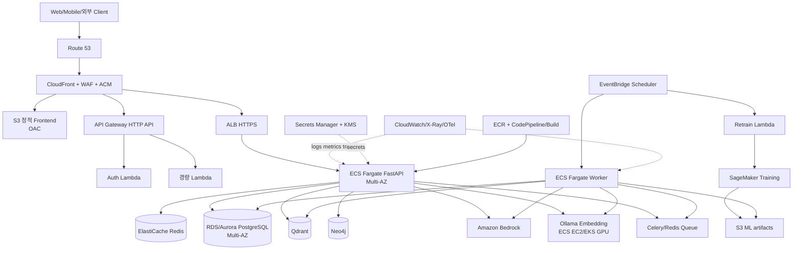
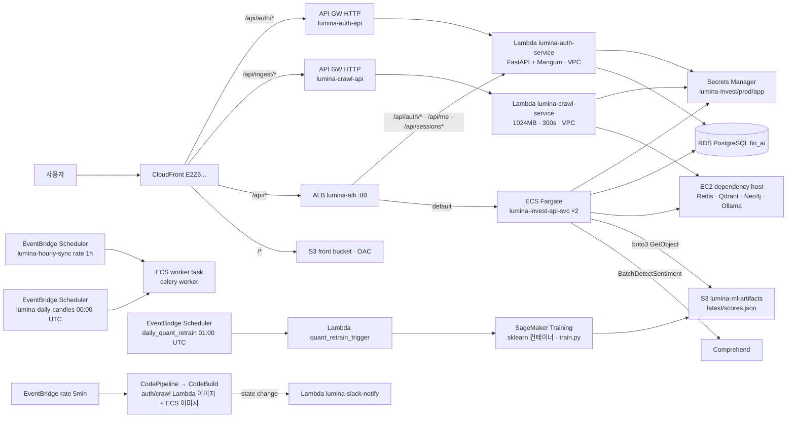
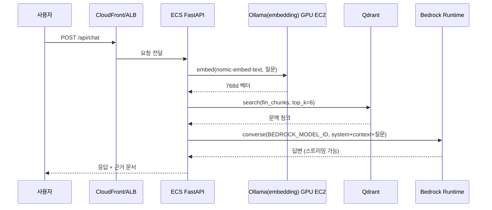

# Lumina Invest AWS 아키텍처 설계서

> 문서 상태: 목표 아키텍처(권장안) + 저장소 내 현재 IaC 진단  
> 기준일: 2026-09-14  
> 기본 리전: `ap-northeast-2` (서비스/모델/인스턴스 가용 여부는 배포 시 재확인)
> 설계서 세트: [onprem.md](onprem.md) (온프레미스 대안) · [aws.md](aws.md) (이 문서) · [pipeline.md](pipeline.md) (데이터 수집·전처리)

## 1. 설계 요약

Lumina Invest의 AWS 운영 기본안은 정적 프론트엔드에 CloudFront/S3, 일반·장시간 API에 ALB/ECS Fargate, 짧고 독립적인 이벤트 API에 API Gateway/Lambda, 생성형 AI에 Amazon Bedrock을 사용한다. PostgreSQL은 RDS, 캐시·세션·현재 Celery broker는 ElastiCache for Redis, 원본/산출물은 S3에 둔다.

Bedrock을 기본안으로 택하면 GPU 서버 운영 부담이 가장 작다. 자체 모델이 필수이면 SageMaker endpoint 또는 ECS/EKS/EC2의 vLLM/Ollama를 선택한다. GPU workload는 일반 Fargate와 분리한다.

> 현재 코드에서 `LLM_PROVIDER`는 `ollama|bedrock|sagemaker|vllm`을 지원하지만 embedding은 항상 `OLLAMA_BASE_URL`의 `nomic-embed-text`를 호출한다. 따라서 Bedrock만 선택해도 Ollama embedding endpoint는 당분간 필요하다. 완전 관리형으로 전환하려면 embedding provider 추상화와 Qdrant collection 재인덱싱을 별도 개발해야 한다.

## 2. 현재 저장소와 목표 상태

| 영역 | 저장소에 있는 구현/IaC | 목표 운영안 |
|---|---|---|
| Edge | CloudFront + S3 + ALB/API Gateway Terraform | Route 53, ACM, CloudFront, WAF, OAC |
| API | ECS Fargate API 2개, ALB | private subnet Fargate, autoscaling, HTTPS only |
| 비동기 | ECS Celery worker, EventBridge Scheduler | worker autoscaling; 장기적으로 SQS 분리 검토 |
| Lambda | auth, crawl, Slack 알림 | auth/경량 이벤트만 동기; 긴 crawl은 queue로 위임 |
| DB | RDS PostgreSQL Terraform | Multi-AZ RDS/Aurora PostgreSQL, RDS Proxy 선택 |
| Cache/queue | secret에 단일 EC2 Redis IP | ElastiCache Redis replication/serverless 검토 |
| AI | Ollama EC2, Bedrock/SageMaker/vLLM client | Bedrock 기본, 자체모델 옵션 분리 |
| Vector/graph | 단일 EC2 Qdrant/Neo4j IP | Qdrant Cloud/EC2/EKS, Neo4j Aura/EC2 중 선택 |
| ML | SageMaker batch training + S3 + Comprehend IaC | 독립 ML stack 유지, model/data version 관리 |
| CI/CD | ECR, CodeBuild, CodePipeline | source-triggered pipeline, immutable tag, canary/rollback |

`terraform/`, `infra/quant-ai/`, `aws-work/ansible/`은 서로 다른 시점과 운영 모델을 나타낸다. apply 전에 하나를 authoritative stack으로 정하고 실제 리소스를 import/state 정리해야 한다. 문서의 `aws-work/README.md`에 있는 계정 ID, IP, endpoint는 설계 입력값이나 secret으로 재사용하지 않는다.

## 3. 권장 아키텍처



### 라우팅 원칙

| 경로/업무 | 권장 origin | 이유 |
|---|---|---|
| `/*` 정적 파일 | S3 + CloudFront OAC | 저비용 캐시, S3 직접 공개 차단 |
| `/api/auth/*` | API Gateway → Lambda | 짧고 독립적인 요청, 탄력 확장 |
| 일반 `/api/*` | CloudFront → ALB → ECS | 연결/timeout 제어, 앱 전체 호환 |
| 동기 AI streaming | ALB → ECS | 장시간/streaming 연결에 적합 |
| 비동기 chat/ingest | ECS가 task id 반환 → worker | 사용자 연결과 장기 작업 분리 |
| 예약 학습/동기화 | EventBridge Scheduler | 일정 중앙 관리, 실행 이력/재시도 |

API Gateway HTTP API의 통합 timeout은 제한되어 있으므로 장시간 crawl/LLM 생성은 Lambda 완료를 기다리는 구조로 만들지 않는다. 현재 `/api/chat/async`, 비동기 ingest와 task 상태 API를 우선 활용하고, 필요하면 SQS + callback/WebSocket/SSE 패턴으로 확장한다.

### 3.1 저장소 IaC가 정의한 실제 요청·이벤트 경로

권장안과 별개로, `terraform/`·`infra/quant-ai/`·`buildspec.yml`이 현재 정의하는 경로는 다음과 같다. 목표 아키텍처는 이 경로를 출발점으로 삼는다.



| 구성 | 현재 정의 | 운영 전 판단 |
|---|---|---|
| Lambda 2종 | 컨테이너 이미지(`public.ecr.aws/lambda/python:3.12`) 위에 FastAPI 앱을 통째로 싣고 Mangum으로 래핑. auth는 API GW와 ALB 양쪽에 연결 | auth는 유지 가치가 있음(짧고 독립적). crawl은 300s 제한과 콜드스타트(LangChain·pandas 포함 이미지)가 커서 비동기 ECS worker로 위임 권장 |
| EventBridge Scheduler → ECS | worker task definition(`celery worker` 명령)을 매시/매일 새로 기동 | 기동만으로는 동기화가 실행되지 않는다. `containerOverrides`로 `celery -A app.celery_app call sync.market_data` 또는 `python -m app.tasks.sync_tasks`류 one-shot 명령을 넘겨야 한다 (13장 체크리스트) |
| SageMaker 배치 | `infra/quant-ai` 독립 스택. Lambda가 매일 Training Job 생성, `scores.json`을 S3에 저장, 앱은 1h 캐시로 읽음 | 그대로 사용. 실패해도 앱은 실시간 계산으로 대체되므로 non-critical |
| Comprehend | EC2 인스턴스 프로파일에 `comprehend:BatchDetectSentiment` 권한 | 한국어 금융 뉴스 품질 검증 후 유지 여부 결정; Bedrock 분류 프롬프트로 대체 가능 |
| KRX 목록 | KIND가 AWS IP를 차단 → `krx/company_list.json`을 S3에 미리 적재 | 주 1회 외부(온프레미스/개발 PC)에서 갱신하는 절차를 운영 문서화 |
| 의존 서비스 EC2 | Redis·Qdrant·Neo4j·Ollama가 t3.medium 1대 | 6장 권장안대로 분리 |

## 4. 컴퓨팅 설계

### 4.1 ECS Fargate: API와 CPU worker

- API와 worker는 private subnet, `assign_public_ip=false`로 두고 ALB 또는 VPC endpoint/NAT를 통해서만 통신한다.
- API 최소 2 task를 서로 다른 AZ에 배치하고 target tracking으로 CPU/memory/ALB request count 기반 확장한다.
- Celery worker는 queue depth와 task runtime을 CloudWatch custom metric으로 내보내 확장한다.
- Celery Beat를 상시 실행한다면 1개 task만 유지한다. 또는 고정 스케줄은 EventBridge Scheduler로 이관해 중복 scheduler를 없앤다.
- API 시작 시 각 task가 Alembic을 실행하는 현재 방식은 경쟁 조건이 생길 수 있다. 배포 전 one-off ECS task로 migration을 1회 실행한다.
- graceful shutdown, deployment circuit breaker, health check grace period, 최소 healthy percent를 설정한다.

### 4.2 Lambda와 API Gateway의 사용 범위

Lambda 권장 업무:

- 회원가입/로그인처럼 짧고 독립적인 endpoint.
- EventBridge 이벤트를 받아 SageMaker job/ECS task/Step Functions를 시작하는 orchestration.
- S3 upload 이벤트의 메타데이터 검사, Slack/SNS 알림.
- 주기적 housekeeping 및 작은 데이터 변환.

Lambda에 직접 두지 않을 업무:

- 모델 weight를 상주시켜야 하는 GPU inference.
- 긴 LLM streaming, 대용량 crawl/embedding, LEAN 백테스트.
- 로컬 filesystem 상태나 장기 DB connection에 의존하는 작업.

긴 workflow는 API Gateway → Lambda/ECS → SQS 또는 Step Functions → ECS task/SageMaker → 상태 저장 순서로 설계한다. 요청에는 idempotency key를 부여하고 DLQ 및 redrive 절차를 둔다.

#### API Gateway 활용 패턴별 정리

| 패턴 | 적용 대상 | 구성 |
|---|---|---|
| HTTP API + Lambda proxy | `/api/auth/*` (현행) | Mangum 래핑 FastAPI, RDS Proxy 권장, 5초 이내 응답 |
| HTTP API + VPC Link → ALB | `/api/*` 전체를 API GW 뒤로 통일하고 싶을 때 | CloudFront→API GW→VPC Link→ALB→ECS. 스로틀링·JWT authorizer를 API GW에서 일괄 적용 |
| REST API + Usage Plan + API Key | 외부 시스템용 모의투자 Open API `/openapi/v1/*` | 앱의 자체 키 인증(SHA-256, Redis rate limit)에 더해 API GW 사용량 플랜으로 고객·키별 쿼터를 이중 적용. WAF rate-based rule 추가 |
| WebSocket API | 자동매매 체결·LEAN 진행률 실시간 푸시 | Lambda가 연결 ID를 DynamoDB에 저장, worker가 `@connections`로 push. 현재 코드는 폴링(`/api/tasks/{id}`)이므로 선택 사항 |
| EventBridge → Lambda → SageMaker/ECS | 재학습, 야간 백필 | `infra/quant-ai` 패턴을 표준으로 재사용 |

CloudFront의 현재 behavior는 `/api/*`와 `/*`만 있어 `/openapi/v1/*`는 S3 origin으로 흘러간다. Open API를 외부에 열려면 `/openapi/*` behavior를 ALB 또는 API GW origin에 추가해야 한다. LEAN 실행(`/api/backtests/lean/run`)은 수 분이 걸릴 수 있어 CloudFront origin read timeout(기본 30초, 최대 60초)을 넘긴다. 운영에서는 비동기 제출 + 상태 조회로 바꾸거나(4.3), 이 경로만 CloudFront를 우회해 ALB로 직접 붙인다.

### 4.3 LEAN 백테스트

Fargate task 안에서 Docker socket을 사용할 수 없으며 사용해서도 안 된다. 권장 옵션은 다음 순서다.

1. 제출 API가 SQS에 job을 넣고 ECS on EC2/EKS Job이 고정된 LEAN image를 실행.
2. AWS Batch가 CPU/memory/time limit가 있는 job definition으로 실행.
3. 격리된 EC2 runner를 SSM으로 관리하고 앱은 내부 job API만 호출.

입력/출력은 S3 presigned URL 또는 job prefix로 전달하고 runner IAM role에는 해당 prefix만 허용한다.

AWS Batch 예시(권장 2안). `quantconnect/lean` 이미지는 약 14GB이므로 ECR로 복제해 두고 compute environment에 EBS 100GB 이상의 launch template을 쓴다.

```json
{
  "jobDefinitionName": "lumina-lean-backtest",
  "type": "container",
  "timeout": { "attemptDurationSeconds": 900 },
  "containerProperties": {
    "image": "<account>.dkr.ecr.ap-northeast-2.amazonaws.com/quantconnect-lean@sha256:<digest>",
    "vcpus": 2, "memory": 4096,
    "command": ["--environment", "backtesting", "--algorithm-language", "Python",
                "--algorithm-type-name", "Ref::algorithm", "--algorithm-location", "/workspace/main.py",
                "--data-folder", "/workspace/data", "--results-destination-folder", "/workspace/results",
                "--backtest-name", "workflow"],
    "jobRoleArn": "arn:aws:iam::<account>:role/lumina-lean-job",
    "mountPoints": [{ "sourceVolume": "workspace", "containerPath": "/workspace" }],
    "volumes": [{ "name": "workspace", "host": { "sourcePath": "/mnt/lean/Ref::workflowId" } }]
  }
}
```

앱 측 흐름: worker가 `prices.csv`/`main.py`/참조데이터를 `s3://<bucket>/lean/<workflowId>/`에 올림 → 입력을 내려받는 init 스크립트를 포함한 래퍼 이미지로 Batch job 제출 → 완료 이벤트(EventBridge) 또는 폴링으로 `results/*-summary.json`을 읽어 `lean_backtest_runs`에 기록. 이는 `LEAN_MODE`의 다섯 번째 모드(`batch`)로 코드 추가가 필요하다.

## 5. AI/ML 리소스 선택

| 옵션 | 적용 상황 | 장점 | 고려사항 | 코드 설정 |
|---|---|---|---|---|
| Amazon Bedrock | 범용 운영 기본 | GPU/모델 서버 운영 불필요, 모델 선택 용이 | 모델 access, quota, 데이터 정책, 리전 확인 | `LLM_PROVIDER=bedrock` |
| SageMaker real-time | 자체 fine-tuned 모델, 전용 endpoint | 모델/컨테이너 통제, autoscaling | 상시 비용, endpoint 운영 | `sagemaker` |
| SageMaker async | 지연 허용 대용량 추론 | queue 기반, scale-to-zero 가능 | cold start, 비동기 API 연동 개발 | 별도 adapter 필요 |
| ECS/EKS on EC2 + vLLM | 높은 처리량/자체 모델 | batching, OpenAI 호환, 세밀한 GPU 통제 | GPU capacity/AMI/driver/스케일링 운영 | `vllm` |
| EC2/ECS EC2 + Ollama | PoC/소규모/embedding | 현재 코드와 가장 단순하게 호환 | HA/동시성/모델 lifecycle 직접 운영 | `ollama` 또는 embedding |
| SageMaker Training | 일/주기 재학습 | 학습 job 격리, Spot 사용 가능 | artifact lineage/evaluation 필요 | `infra/quant-ai` |
| Comprehend | 뉴스 감성 보조 | 관리형 NLP | 한국어/금융 도메인 품질 검증 필요 | 기존 fallback 구현 |

권장 단계:

1. 생성형 chat은 Bedrock, embedding은 현재 호환성을 위해 Ollama GPU endpoint로 운영한다.
2. embedding provider interface를 추가해 Bedrock 또는 SageMaker embedding으로 교체 가능하게 만든다.
3. 새 embedding model은 새 Qdrant collection에 전체 재색인하고 품질 평가 후 alias를 전환한다.
4. 자체 생성 모델의 비용/latency/품질이 Bedrock보다 유리할 때만 vLLM/SageMaker로 전환한다.

### AI 리소스별 적용 지점 (코드 기준)

| 기능 | 호출 코드 | 기본(온프레미스) | AWS 대체 리소스 | 전환에 필요한 코드 변경 |
|---|---|---|---|---|
| 투자 상담 채팅, ReAct 에이전트, 리서치 요약 | `app/lib/llm_client.py` `chat()`, `langgraph_agent.py` | Ollama `llama3.1` | Bedrock Converse (`LLM_PROVIDER=bedrock`, `BEDROCK_MODEL_ID` 예: `anthropic.claude-*`, `meta.llama3-*`; 리전 가용성 확인) · SageMaker JumpStart 엔드포인트 (`sagemaker/deploy_llm_endpoint.py`, 기본 Llama 3.2 3B on `ml.g5.xlarge`) · vLLM on EC2 | 없음 (설정만) |
| 임베딩 (RAG 저장·검색) | `_EmbedViaOllamaMixin`, `rag_pipeline._make_embeddings` | Ollama `nomic-embed-text` 768d | Bedrock Titan Text Embeddings v2 (1024d) 또는 SageMaker 임베딩 엔드포인트 | provider 추상화 + Qdrant 재색인 필요 |
| 문서 이미지 설명 (VLM) | `doc_parser._vlm_describe` | Ollama `llava` | Bedrock 멀티모달 모델 (Claude 3.x 계열 이미지 입력) | `VLM` 경로 provider 분기 필요 |
| 뉴스 감성 | `sentiment.py` | 없음(None) | Comprehend `BatchDetectSentiment` (현행) | 없음 |
| 종목 방향성 배치 학습 | `sagemaker/train.py` | K8s CronJob | SageMaker Training (sklearn 1.2-1 컨테이너, 일 1회, Spot 가능) | 없음 |
| 실시간 방향성 분류·회귀·군집 | `quant_pipeline`, `ml_models` (LightGBM/sklearn CPU) | API 프로세스 | Fargate CPU로 충분. 대량 배치는 SageMaker Processing | 없음 |
| 백테스트 | `lean_backtest.py` | Docker/K8s Job | AWS Batch / ECS on EC2 | `batch` 모드 추가 |
| 알림 | `notification.py` | Telegram/Slack/SMTP/CoolSMS | 동일 + SNS/Chatbot 옵션 | 없음 |

Bedrock 기준 채팅 요청 흐름:



Bedrock 사용 시 확인 사항: 모델 액세스 신청, 리전별 모델 가용성(서울 리전은 일부 모델 미제공 → cross-region inference profile 검토), 계정 토큰/분 quota, 데이터 미학습 정책, VPC endpoint(`bedrock-runtime`)로 NAT 우회.

### GPU 자체 호스팅

- GPU는 ECS Fargate가 아니라 ECS on EC2/EKS/직접 EC2에 배치한다. ECS GPU-optimized AMI와 GPU task resource requirement를 사용한다.
- GPU Auto Scaling Group은 일반 compute와 다른 capacity provider로 만들고 On-Demand baseline + 중단 가능한 batch에만 Spot을 쓴다.
- 모델 artifact는 versioned S3 또는 사전 bake한 EBS snapshot에서 가져오고 checksum을 검증한다.
- endpoint는 internal NLB/ALB 또는 Cloud Map으로만 노출하고 API/worker security group에서만 접근시킨다.
- scale-from-zero는 긴 cold start가 있으므로 대화형 서비스에는 warm capacity를 유지한다.

## 6. 데이터 계층

### PostgreSQL

- RDS PostgreSQL Multi-AZ를 기본으로 하고 워크로드 규모/읽기 확장 요구가 크면 Aurora PostgreSQL을 검토한다.
- 암호화(KMS), automated backup/PITR, deletion protection, Performance Insights/Enhanced Monitoring을 켠다.
- DB subnet group은 최소 2개 private AZ, public access는 끈다.
- connection 폭증이 예상되는 Lambda에는 RDS Proxy를 검토한다.
- migration은 one-off 배포 task에서 수행하고 app task role과 migration role을 분리한다.

### Redis

현재 세션, 캐시, Celery broker/result를 한 Redis URL로 공유한다. 운영에서는 논리 DB만 나누는 것보다 최소한 세션/캐시와 queue를 replication group 또는 cluster 단위로 분리하는 편이 장애 격리에 유리하다.

- in-transit/at-rest encryption, AUTH token/ACL, Multi-AZ failover.
- eviction policy는 session/result 유실 허용 범위에 맞춘다.
- Celery task는 at-least-once 가능성을 전제로 idempotent하게 만든다.
- 장기적으로 broker를 SQS로 바꿀 경우 Celery transport 호환성과 result backend를 별도 검증한다.

### Qdrant와 Neo4j

| 서비스 | 빠른 시작 | 운영 권장 | 비고 |
|---|---|---|---|
| Qdrant | EC2 + EBS | Qdrant Cloud 또는 EKS/EC2 3노드 | snapshot을 S3에 저장, private endpoint |
| Neo4j | EC2 + EBS | Neo4j Aura 또는 Enterprise cluster | 라이선스, private connectivity, backup 확인 |

두 서비스 모두 단일 dependency EC2에 함께 배치하는 현 구조는 장애 범위가 크다. 최소한 별도 EBS/backup과 Auto Recovery를 적용하고, 운영 중요도가 올라가면 각 서비스의 다중 노드/관리형 구성을 선택한다.

### 데이터 파이프라인 실행 매핑

수집·전처리의 상세 설계는 [pipeline.md](pipeline.md)를 따른다. AWS에서의 실행 주체만 요약하면 다음과 같다.

| 파이프라인 단계 | AWS 실행 | 비고 |
|---|---|---|
| 시장 데이터 1h 동기화 · 유니버스 캔들 24h 워밍 | EventBridge Scheduler → ECS Fargate worker one-shot task | 앱 내 `sync_scheduler` 루프와 Celery Beat는 끄고 EventBridge를 단일 스케줄러로 사용 |
| 히스토리 백필 (`ohlcv_daily`) | Step Functions Map → ECS task (종목 배치) 또는 Glue Python shell | 429 백오프, `fetch_log` 기록 |
| 크롤링·인제스트·임베딩 | ECS worker (Celery) | Lambda crawl은 300s 이내 소형 작업으로 한정 |
| 감성분석 | Comprehend | 크롤링 워커 IAM에 권한 부여 |
| 재학습 | SageMaker Training → S3 `latest/scores.json` | 현행 `infra/quant-ai` |
| KRX 상장법인목록 | 외부에서 갱신해 S3 `krx/company_list.json` 업로드 | KIND가 AWS IP 차단 |
| 코인·대체자산 시세 (모의투자) | ECS API에서 온디맨드 (Upbit/Bithumb/Korbit/Yahoo) | NAT 경유 egress allowlist에 도메인 추가 |

외부 egress allowlist(Network Firewall 또는 프록시): `*.finance.yahoo.com`, `fc.yahoo.com`, `api.upbit.com`, `api.bithumb.com`, `api.korbit.co.kr`, `finance.naver.com`, `api.github.com`, `raw.githubusercontent.com`, `openapi.koreainvestment.com`, `openapivts.koreainvestment.com`, `developer.kbsec.com`, `paper-api.alpaca.markets`, 알림 채널 엔드포인트. AWS 서비스(S3, Secrets Manager, ECR, CloudWatch, Bedrock, Comprehend, SageMaker Runtime)는 VPC endpoint로 처리해 NAT 비용과 노출을 줄인다.

### S3

버킷을 frontend, raw documents, ML artifacts, backup, access logs로 분리한다. Block Public Access, bucket owner enforced, versioning, SSE-KMS, lifecycle, 필요한 버킷의 Object Lock을 적용한다. Frontend만 CloudFront OAC를 통해 읽게 한다.

## 7. VPC 및 연결

```text
Public subnets (2+ AZ): ALB, NAT Gateway
Private app subnets: ECS API/worker, Lambda ENI
Isolated data subnets: RDS, ElastiCache, Qdrant/Neo4j
Private AI subnets: GPU ASG/EKS/SageMaker interface
```

- AZ별 NAT Gateway가 가용성 기본안이지만 비용 민감 환경은 single NAT의 장애 위험을 명시한다.
- S3/DynamoDB gateway endpoint와 ECR API/DKR, CloudWatch Logs, Secrets Manager, STS, Bedrock Runtime 등 필요한 interface VPC endpoint를 검토한다.
- security group 참조 방식으로 `ALB→API:8000`, `API/worker→DB/Redis/vector/graph/AI`만 허용한다.
- DB, Redis, Qdrant, Neo4j, Ollama/vLLM에 public IP를 주지 않는다.
- 외부 금융 API egress는 NAT/Network Firewall/프록시를 통해 도메인·목적별로 기록하고 제한한다.
- 관리자 접속은 public bastion SSH 대신 SSM Session Manager를 기본으로 한다.

## 8. 보안 및 거버넌스

- CloudFront에 AWS WAF managed rules, rate-based rules, bot/공격 패턴 차단을 적용한다.
- HTTPS only, ACM 인증서, HSTS, secure/httpOnly/sameSite cookie를 사용한다.
- Secrets Manager에는 실제 secret만 저장하고 일반 설정은 ECS environment/AppConfig/SSM Parameter Store로 분리한다.
- task execution role, app task role, Lambda role, SageMaker role을 분리하고 resource/prefix 단위 최소 권한을 적용한다.
- KMS key 정책과 IAM 정책 양쪽을 검증한다. secret과 broker token은 자동 회전 전략을 둔다.
- CloudTrail, AWS Config, GuardDuty, Security Hub, ECR scan, Inspector를 조직 표준에 맞게 사용한다.
- 개인정보/계좌/주문/대화 데이터의 분류, 리전 반출, 보존/파기, 접근 감사 요구를 배포 전에 확정한다.
- 생성형 AI 요청 로그에는 원문을 기본 저장하지 않고 필요한 경우 명시적 동의·마스킹·짧은 보존 기간을 적용한다.
- 실제 주문 endpoint에는 MFA/step-up 인증, idempotency, 한도, kill switch, 불변 감사 로그를 둔다.

## 9. 관측성, SLO와 알림

| 계층 | 관측 항목 |
|---|---|
| CloudFront/WAF/API GW/ALB | request, cache hit, 4xx/5xx, WAF block, target latency |
| ECS/Lambda | task count, CPU/memory, cold start, timeout, throttling, deployment failure |
| Celery | queue depth/age, retry/failure, task runtime, worker heartbeat |
| AI | provider/model, latency/TTFT, throttling, token 사용량, GPU/VRAM/queue |
| RDS/Redis | connections, locks, replication lag, free storage, eviction, failover |
| 업무 | 주문 실패/중복, 데이터 freshness, RAG empty result, 학습 성공/모델 버전 |

- CloudWatch Logs는 JSON 구조화하고 correlation id를 API→worker→AI까지 전달한다.
- ADOT/OpenTelemetry + X-Ray로 분산 trace를 구성하되 민감 payload는 제외한다.
- CloudWatch Alarm → SNS/Chatbot/PagerDuty 등으로 심각도별 전달한다.
- dashboard는 서비스 health, AI 품질/비용, 데이터 freshness, 배포 상태를 분리한다.
- 예시 SLO는 일반 API 99.9%, AI 성공률 99%, 주문 API 오류율 0.1% 미만이며 실제 부하/업무 기준으로 승인한다.

## 10. CI/CD와 IaC

권장 pipeline:

```text
Source trigger → test/lint/SAST → image build → SBOM/sign/scan
→ ECR immutable tag → dev deploy/smoke → approval
→ DB migration one-off task → ECS canary/rolling → alarm rollback
```

- `latest` 대신 Git SHA/digest를 task definition에 넣고 ECR tag immutability를 켠다.
- pipeline을 5분마다 무조건 시작하지 말고 source 변경/event 기반으로 실행한다.
- Terraform state는 암호화 S3 backend + DynamoDB 또는 지원되는 state locking을 사용하고 환경/account별로 분리한다.
- plan을 PR artifact로 검토하고 production apply는 승인과 audit trail을 남긴다.
- Ansible과 Terraform이 같은 리소스를 동시에 소유하지 않도록 resource ownership 표를 둔다.
- dev/stage/prod는 가급적 별도 AWS account로 분리하고 Organizations/SCP/Budget을 적용한다.

## 11. 백업과 재해복구

| 대상 | 권장 보호 | 복구 검증 |
|---|---|---|
| RDS | automated backup/PITR + cross-region snapshot copy | 분기별 restore 및 앱 smoke test |
| ElastiCache | snapshot + parameter/ACL IaC | 새 replication group 복원 |
| Qdrant | collection snapshot → versioned S3 | 별도 endpoint에 restore/search |
| Neo4j | 제품 지원 backup → S3 | 버전 호환 restore |
| S3 | versioning, replication/Object Lock 선택 | 객체/manifest checksum |
| ECR/IaC/model | cross-region 복제 또는 artifact copy | clean account/region 재배포 |

권장 시작 목표는 RPO 15분/RTO 4시간이다. active-active multi-region은 세션, DB 쓰기, 주문 idempotency, vector/graph 복제를 함께 풀어야 하므로 필요성이 입증된 뒤 적용한다. 초기에는 warm standby 또는 backup-and-restore가 현실적이다.

## 12. 비용 통제

- Bedrock/SageMaker/자체 GPU를 동일 prompt set으로 품질·p95 latency·요청당 비용 비교한다.
- 개발 GPU endpoint는 schedule/scale-to-zero 가능한 방식을 사용하고 운영 chat에는 필요한 warm capacity만 둔다.
- Fargate worker는 queue 기반 확장, batch/retraining은 Spot을 사용하되 checkpoint와 재시도를 설계한다.
- S3 lifecycle, CloudWatch log retention, ECR lifecycle, NAT data processing, cross-AZ traffic을 월별 검토한다.
- AWS Budgets/Cost Anomaly Detection과 `Application`, `Environment`, `Owner`, `CostCenter`, `DataClass` tag를 강제한다.
- 리전별 가격과 모델 quota가 바뀔 수 있으므로 배포 시 AWS Pricing Calculator와 Service Quotas로 다시 산정한다.

## 13. 현재 Terraform 운영 전 필수 보완

저장소의 `terraform/`을 그대로 production에 적용하기 전에 다음을 수정해야 한다.

- [ ] private subnet ECS/Lambda에서 `assign_public_ip=true`를 제거하고 NAT/VPC endpoint를 설계한다.
- [ ] ALB HTTP listener를 HTTPS/ACM으로 바꾸고 HTTP는 HTTPS redirect만 허용한다.
- [ ] `COOKIE_SECURE=false`를 production에서 `true`로 바꾼다.
- [ ] Secrets Manager의 `ChangeMe`와 단일 EC2 사설 IP placeholder를 실제 관리형 endpoint로 교체한다.
- [ ] RDS Multi-AZ, encryption, backup retention, deletion protection을 검증한다.
- [ ] ElastiCache가 IaC에 없으므로 추가하고 Redis TLS/auth에 맞춰 client URL을 수정한다.
- [ ] Qdrant/Neo4j/Ollama의 단일 EC2 장애점을 제거하거나 허용 위험으로 승인한다.
- [ ] ECS API/worker autoscaling, PDB 상당의 AZ 배치, deployment rollback alarm을 추가한다.
- [ ] API task startup의 Alembic을 one-off migration task로 분리한다.
- [ ] EventBridge Scheduler가 worker image만 실행하지 않고 실제 task command/payload를 전달하는지 검증한다 (현재는 `celery worker`를 기동만 하고 종료하지 않으므로 Fargate task가 계속 살아 비용이 누적된다).
- [ ] CloudFront에 `/openapi/*` behavior를 추가하고 LEAN 실행 경로의 timeout 전략(비동기화 또는 우회)을 정한다.
- [ ] `terraform/postgres.tf`의 RDS 마스터 비밀번호를 Secrets Manager 관리형으로 바꾸고 `DATABASE_URL`을 동기화한다.
- [ ] 5분 주기 CodePipeline trigger를 source event 기반으로 교체한다.
- [ ] CloudFront/API Gateway/ALB access logs와 WAF를 추가한다.
- [ ] Terraform, `infra/quant-ai`, Ansible, 실제 리소스의 state/소유권을 정리한다.
- [ ] 계정 ID, public URL, 인스턴스 ID가 포함된 운영 기록의 공개 범위와 rotation 필요성을 검토한다.

## 14. 단계별 전환 계획

### Phase 1: 기반 안정화

- authoritative IaC/state 확정, HTTPS/WAF/private subnet/secret 교체.
- PostgreSQL RDS와 ElastiCache로 이동하고 backup/restore를 검증한다.
- 현재 ECS API/worker를 immutable image와 deployment rollback으로 운영한다.

### Phase 2: AI 및 데이터 분리

- chat을 Bedrock으로 전환하고 Ollama는 embedding 전용 GPU endpoint로 분리한다.
- Qdrant/Neo4j를 dependency EC2에서 독립 서비스로 옮긴다.
- crawl/chat/LEAN 장기 작업을 비동기 queue/job 구조로 바꾼다.

### Phase 3: 고도화

- embedding provider 추상화, 신규 collection 재인덱싱과 AI 회귀 평가를 자동화한다.
- SageMaker retraining/model registry/evaluation/승인 흐름을 연결한다.
- cross-region backup/restore 훈련, 비용/성능 부하 시험, SLO를 운영 승인한다.

## 15. AWS 공식 참고자료

- [ECS GPU workload task definition](https://docs.aws.amazon.com/AmazonECS/latest/developerguide/ecs-gpu.html)
- [Fargate task definition 차이와 GPU 제한](https://docs.aws.amazon.com/AmazonECS/latest/developerguide/fargate-tasks-services.html)
- [API Gateway HTTP API quota와 integration timeout](https://docs.aws.amazon.com/apigateway/latest/developerguide/http-api-quotas.html)
- [SageMaker Asynchronous Inference autoscaling](https://docs.aws.amazon.com/sagemaker/latest/dg/async-inference-autoscale.html)
- [AWS PrivateLink 개념](https://docs.aws.amazon.com/vpc/latest/privatelink/concepts.html)

## 16. 관련 파일

- 데이터 수집·전처리 설계: [`pipeline.md`](pipeline.md)
- 기본 AWS Terraform: [`terraform/`](terraform/)
- CI/CD 빌드 정의: [`buildspec.yml`](buildspec.yml)
- LLM provider 추상화: [`app/lib/llm_client.py`](app/lib/llm_client.py)
- LEAN 실행 모드: [`app/services/lean_backtest.py`](app/services/lean_backtest.py)
- Quant AI Terraform: [`infra/quant-ai/`](infra/quant-ai/)
- 기존 AWS 운영 기록/Ansible: [`aws-work/README.md`](aws-work/README.md)
- SageMaker 코드: [`sagemaker/`](sagemaker/)
- Lambda 분리 서비스: [`services/`](services/)
- 온프레미스 대안 설계: [`onprem.md`](onprem.md)
