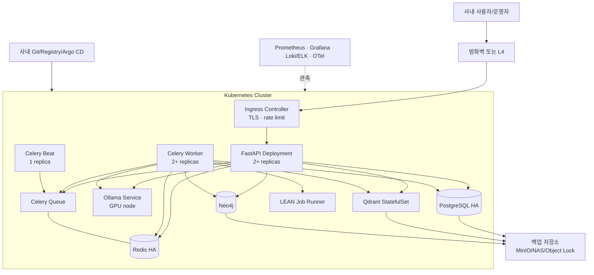

# Lumina Invest 온프레미스 아키텍처 설계서

> 문서 상태: 목표 아키텍처(권장안)  
> 기준일: 2026-09-14  
> 적용 범위: 사내망/IDC/폐쇄망의 Docker Compose 개발 환경과 Kubernetes 운영 환경
> 설계서 세트: [onprem.md](onprem.md) (이 문서) · [aws.md](aws.md) (AWS 대안) · [pipeline.md](pipeline.md) (데이터 수집·전처리)

## 1. 목적과 전제

이 문서는 Lumina Invest를 외부 AI 서비스에 의존하지 않고 사내 인프라에서 운영하기 위한 설계 기준이다. 개발·데모는 Docker Compose, 운영은 Kubernetes를 기본으로 하며 로컬 LLM/임베딩은 Ollama와 NVIDIA GPU를 사용한다.

현재 애플리케이션의 실제 주요 의존성은 다음과 같다.

| 영역 | 현재 구현 | 온프레미스 목표 |
|---|---|---|
| API/UI | FastAPI가 API와 정적 파일을 함께 제공 | Ingress 뒤의 복수 FastAPI Pod; 정적 파일은 별도 Nginx도 가능 |
| 비동기 처리 | Celery worker/beat, Redis broker/result backend | worker 복수화, beat 단일 leader, 큐 유형별 분리 |
| 관계형 데이터 | PostgreSQL + Alembic | HA PostgreSQL 및 자동 백업 |
| 캐시/세션/큐 | Redis | Sentinel/Cluster 또는 운영형 Redis |
| 그래프 | Neo4j | 전용 StatefulSet/VM; HA 필요 시 Enterprise 라이선스 검토 |
| 벡터 검색 | Qdrant | SSD 기반 StatefulSet, 스냅샷 백업, 운영 시 3노드 권장 |
| LLM | `ollama`, `bedrock`, `sagemaker`, `vllm` 선택 가능 | `LLM_PROVIDER=ollama`, GPU 노드의 Ollama |
| 임베딩 | provider와 무관하게 Ollama `nomic-embed-text` 사용 | Ollama embedding pool 유지 |
| 백테스트 | LEAN `docker`(CLI 또는 Engine API 소켓)/`ssh`/`local` (`LEAN_MODE`) | 격리된 전용 runner 또는 Kubernetes Job |
| 모의투자·Open API | 주식/코인/대체자산 모의계좌, `/openapi/v1` 키 인증 + Redis 분당 rate limit | 동일; Redis 미연결 시 프로세스 메모리 폴백은 다중 replica에서 무효 |
| 데이터 수집 | Yahoo·KRX KIND·Upbit 등 외부 HTTP + 앱 내 1h 루프/Celery Beat | 단일 스케줄러 + egress allowlist ([pipeline.md](pipeline.md)) |

> 저장소의 현재 `docker-compose.yml`은 PostgreSQL, Redis, Neo4j, app, ingest, Celery worker/beat를 실행한다. Ollama와 Qdrant는 compose에 포함되어 있지 않으므로 별도 호스트/컨테이너가 필요하다. 이 문서의 Kubernetes 구성은 설계안이며 배포 manifest가 이미 존재한다는 의미는 아니다.

## 2. 목표와 비기능 요구사항

| 항목 | 권장 기준 |
|---|---|
| 가용성 | API/worker 무중단 배포, 단일 노드 장애 시 핵심 API 지속 |
| 확장성 | API·worker·LLM을 독립 확장; GPU와 일반 노드 풀 분리 |
| 보안 | 인터넷 비노출 기본, TLS, 최소 권한, secret 외부 관리, 감사 로그 |
| 데이터 보호 | DB/PVC/벡터 스냅샷의 별도 백업 저장소 보관 및 정기 복구 훈련 |
| 관측성 | 메트릭·로그·트레이스 통합, GPU/LLM 및 큐 지연 관측 |
| 재해복구 | 권장 RPO 15분, RTO 4시간; 조직 요구에 따라 조정 |
| AI 품질 | 모델/프롬프트/임베딩 버전 고정 및 회귀 평가 |

## 3. 논리 아키텍처



### 주요 요청 흐름

1. 일반 API: 사용자 → Ingress → FastAPI → PostgreSQL/Redis/Neo4j.
2. 동기 AI 질의: FastAPI → Qdrant 검색 → Ollama embedding/chat → 응답. 긴 응답에는 streaming과 별도 timeout 정책을 적용한다.
3. 비동기 AI/인제스트: FastAPI가 Celery task id를 반환 → worker가 Qdrant/Ollama 처리 → Redis 결과 조회.
4. 정기 작업: Celery Beat가 시장 데이터 동기화와 캔들 작업을 발행한다. Beat는 중복 스케줄 방지를 위해 1개만 실행한다.
5. LEAN: worker가 권한이 제한된 runner에 작업을 요청하고, runner가 임시 Job을 만든 뒤 결과만 반환한다.

## 4. 배포 토폴로지

### 4.1 Docker Compose: 개발·단일 서버

권장 최소 구성은 다음과 같다.

| 서비스 | 권장 자원 시작점 | 영속 경로 | 비고 |
|---|---:|---|---|
| app | 2 vCPU / 4 GiB | app data | 1개 |
| worker | 4 vCPU / 8 GiB | app data | AI/인제스트 concurrency 조정 |
| beat | 0.5 vCPU / 512 MiB | schedule file | 반드시 1개 |
| PostgreSQL | 2 vCPU / 8 GiB | NVMe/SSD | WAL 백업 |
| Redis | 1 vCPU / 2 GiB | SSD | AOF 사용 검토 |
| Neo4j | 2 vCPU / 8 GiB | SSD | heap/page cache 튜닝 |
| Qdrant | 4 vCPU / 16 GiB | NVMe 권장 | 벡터 수에 맞춰 산정 |
| Ollama | 8 vCPU / 32 GiB + GPU | 모델 디스크 | VRAM이 모델 동시성 결정 |

개발 구성 원칙:

- 기존 compose가 요구하는 외부 네트워크 `shared-net`을 먼저 만들거나 compose에서 내부 네트워크로 변경한다.
- `.env`의 기본 비밀번호를 사용하지 않고, 운영 secret은 compose 파일에 평문으로 넣지 않는다.
- Ollama는 `11434`, Qdrant는 `6333`, Neo4j Browser는 `7474`를 외부에 공개하지 않는다.
- NVIDIA Container Toolkit을 설치하고 Ollama 컨테이너에 GPU를 할당한다.
- `latest` 대신 검증된 이미지 digest/tag를 고정한다.
- 단일 서버는 HA가 아니므로 교육·PoC·복구 가능한 소규모 환경으로 한정한다.

### 4.2 Kubernetes: 운영 권장

노드 풀을 다음처럼 분리한다.

| 노드 풀 | 워크로드 | 권장 속성 |
|---|---|---|
| system | DNS, ingress, monitoring, GitOps | 3개 control-plane/worker 또는 관리형 제어면 |
| general | API, Celery, 관리 도구 | 3개 이상, 서로 다른 장애 도메인 |
| data | PostgreSQL/Qdrant/Neo4j/Redis | local NVMe 또는 고성능 CSI, 전용 taint |
| gpu | Ollama/vLLM | NVIDIA GPU, device plugin/GPU Operator, 전용 taint |
| batch | LEAN, ML/인제스트 | preemptible 가능, 리소스 quota |

워크로드별 Kubernetes 객체:

| 컴포넌트 | 객체 | 확장/배치 기준 |
|---|---|---|
| FastAPI | Deployment, Service, HPA, PDB | CPU + 요청 지연; 최소 2 replicas |
| Celery worker | Deployment, KEDA/HPA | Redis queue length; task 유형별 queue 분리 |
| Celery Beat | Deployment 1 replica | `Recreate`; leader 중복 금지 |
| Ollama | StatefulSet 또는 Deployment | GPU 1개 이상 요청, 모델별 node affinity |
| Qdrant | StatefulSet/공식 Helm | 3 replicas, anti-affinity, SSD PVC |
| PostgreSQL | 검증된 DB operator | primary/replica, synchronous 정책 결정 |
| Redis | 운영형 operator/Helm | Sentinel 또는 Cluster |
| Neo4j | 공식 Helm/전용 VM | Community 단일 노드의 가용성 한계 명시 |
| LEAN | Job | namespace 격리, TTL, CPU/memory/ephemeral 제한 |

### GPU 스케줄링과 모델 서빙

- NVIDIA 드라이버/CUDA 호환 버전을 노드 이미지에 고정하고 device plugin 또는 GPU Operator로 `nvidia.com/gpu`를 노출한다.
- Ollama Pod에는 `limits: nvidia.com/gpu: 1`과 GPU taint toleration/node affinity를 둔다.
- `llama3.1`, `nomic-embed-text`, `llava`의 실제 variant/quantization을 명시적으로 고정한다. 이름만 고정하면 모델 갱신 시 재현성이 깨질 수 있다.
- chat과 embedding의 부하 특성이 다르므로 트래픽이 늘면 Ollama deployment/queue를 분리한다.
- VRAM 산정은 모델 weight뿐 아니라 KV cache, context length, batch/concurrency 여유를 포함해 부하 시험으로 확정한다.
- 단일 GPU는 장애점이다. 업무 중요도가 높으면 동일 모델을 두 GPU 노드에 배치하고 readiness가 통과한 endpoint만 서비스한다.
- 더 높은 동시성이 필요하면 코드가 이미 지원하는 `LLM_PROVIDER=vllm`을 검토할 수 있으나, 현재 embedding은 여전히 Ollama가 필요하다.

### 4.3 참조 구성 예시

아래 예시는 저장소에 없는 목표 구성을 구체화한 것이다. 실제 적용 시 이미지 digest, 스토리지 클래스, 네임스페이스 이름을 조직 표준에 맞춘다.

#### Docker Compose: GPU Ollama·Qdrant 오버레이

현재 `docker-compose.yml`에는 Ollama와 Qdrant가 없다. 단일 GPU 서버에서는 다음 오버레이를 `-f docker-compose.yml -f docker-compose.gpu.yml`로 겹쳐 쓴다. 사전 조건: NVIDIA 드라이버 + NVIDIA Container Toolkit.

```yaml
# docker-compose.gpu.yml (예시)
services:
  ollama:
    image: ollama/ollama:0.6.5
    container_name: fin-ai-ollama
    volumes: [ollama_models:/root/.ollama]
    networks: [shared-net]
    deploy:
      resources:
        reservations:
          devices:
            - driver: nvidia
              count: 1            # GPU 2장이면 count: 2 또는 device_ids
              capabilities: [gpu]
    environment:
      - OLLAMA_KEEP_ALIVE=24h     # 모델 상주(콜드 로드 방지)
      - OLLAMA_NUM_PARALLEL=4     # 동시 요청 수 = VRAM 여유에 맞춰 조정
      - OLLAMA_MAX_LOADED_MODELS=3  # llama3.1 + nomic-embed-text + llava
    restart: unless-stopped
  qdrant:
    image: qdrant/qdrant:v1.12.4
    container_name: fin-ai-qdrant
    volumes: [qdrant_data:/qdrant/storage]
    networks: [shared-net]
    restart: unless-stopped
  app:
    environment:
      - OLLAMA_BASE_URL=http://ollama:11434
      - QDRANT_URL=http://qdrant:6333
      - LLM_PROVIDER=ollama
  celery-worker:
    environment:
      - OLLAMA_BASE_URL=http://ollama:11434
      - QDRANT_URL=http://qdrant:6333
volumes:
  ollama_models:
  qdrant_data:
```

모델은 기동 후 한 번 내려받아 볼륨에 고정한다: `docker exec fin-ai-ollama ollama pull llama3.1:8b-instruct-q4_K_M && ... nomic-embed-text && ... llava`. 폐쇄망이면 외부에서 받은 `~/.ollama` 디렉터리를 볼륨으로 반입한다.

VRAM 산정 시작점 (4-bit 양자화, 8K context 기준):

| 모델 | 가중치 | 동시 4요청 KV cache 여유 | 권장 GPU |
|---|---:|---:|---|
| llama3.1 8B q4 | ~5 GB | +3~4 GB | 12 GB 이상 (RTX 4070Ti/A2000 12G 이상) |
| nomic-embed-text | ~0.3 GB | 미미 | chat GPU 공유 가능 |
| llava 7B q4 | ~4.5 GB | +2 GB | 동시 적재 시 24 GB 권장 (RTX 4090/A10/L4) |
| llama3.1 70B q4 | ~40 GB | +10 GB | A100 80G 또는 2×L40S |

#### Kubernetes: 네임스페이스와 핵심 매니페스트

네임스페이스 분리: `lumina-app`(API/worker/beat), `lumina-data`(PostgreSQL/Redis/Qdrant/Neo4j), `lumina-ai`(Ollama/vLLM), `lumina-batch`(LEAN/재학습 Job), `lumina-obs`(모니터링).

```yaml
# FastAPI API (lumina-app)
apiVersion: apps/v1
kind: Deployment
metadata: { name: lumina-api, namespace: lumina-app }
spec:
  replicas: 2
  strategy: { type: RollingUpdate, rollingUpdate: { maxUnavailable: 0, maxSurge: 1 } }
  template:
    spec:
      securityContext: { runAsNonRoot: true, runAsUser: 10001, seccompProfile: { type: RuntimeDefault } }
      containers:
        - name: api
          image: registry.internal/lumina-invest@sha256:<digest>
          command: ["uvicorn", "app.main:app", "--host", "0.0.0.0", "--port", "8000"]
          envFrom: [{ configMapRef: { name: lumina-config } }, { secretRef: { name: lumina-secrets } }]
          env:
            - { name: LLM_PROVIDER, value: ollama }
            - { name: OLLAMA_BASE_URL, value: http://ollama.lumina-ai.svc:11434 }
            - { name: LEAN_MODE, value: local }        # API Pod는 LEAN을 직접 실행하지 않는다
          resources: { requests: { cpu: "500m", memory: 1Gi }, limits: { cpu: "2", memory: 4Gi } }
          readinessProbe: { httpGet: { path: /api/health, port: 8000 }, periodSeconds: 10 }
          livenessProbe:  { httpGet: { path: /api/health, port: 8000 }, periodSeconds: 30 }
---
# Ollama on GPU node (lumina-ai)
apiVersion: apps/v1
kind: Deployment
metadata: { name: ollama, namespace: lumina-ai }
spec:
  replicas: 1
  strategy: { type: Recreate }
  template:
    spec:
      nodeSelector: { nvidia.com/gpu.present: "true" }
      tolerations: [{ key: nvidia.com/gpu, operator: Exists, effect: NoSchedule }]
      containers:
        - name: ollama
          image: ollama/ollama:0.6.5
          env:
            - { name: OLLAMA_KEEP_ALIVE, value: 24h }
            - { name: OLLAMA_NUM_PARALLEL, value: "4" }
          resources:
            limits: { nvidia.com/gpu: 1, memory: 32Gi }
            requests: { cpu: "4", memory: 16Gi }
          volumeMounts: [{ name: models, mountPath: /root/.ollama }]
          readinessProbe: { httpGet: { path: /api/tags, port: 11434 }, periodSeconds: 15 }
      volumes: [{ name: models, persistentVolumeClaim: { claimName: ollama-models } }]
---
# Celery worker autoscaling on Redis queue length (KEDA)
apiVersion: keda.sh/v1alpha1
kind: ScaledObject
metadata: { name: lumina-worker, namespace: lumina-app }
spec:
  scaleTargetRef: { name: lumina-worker }
  minReplicaCount: 1
  maxReplicaCount: 6
  triggers:
    - type: redis
      metadata: { addressFromEnv: REDIS_HOST_PORT, listName: celery, listLength: "5" }
---
# Alembic migration: 배포 전 1회 실행 (API Pod 기동 시 자동 마이그레이션은 끈다)
apiVersion: batch/v1
kind: Job
metadata: { name: lumina-migrate, namespace: lumina-app }
spec:
  backoffLimit: 1
  template:
    spec:
      restartPolicy: Never
      containers:
        - name: migrate
          image: registry.internal/lumina-invest@sha256:<digest>
          command: ["alembic", "upgrade", "head"]
          envFrom: [{ secretRef: { name: lumina-secrets } }]
```

> 현재 `app/main.py`는 lifespan에서 Alembic을 실행한다. Kubernetes에서는 여러 API Pod가 동시에 마이그레이션을 시도하므로 위 Job으로 분리하고 앱에는 `RUN_MIGRATIONS=false` 같은 스위치를 추가하는 것을 권장한다(코드 변경 필요).

#### LEAN Job runner

```yaml
apiVersion: batch/v1
kind: Job
metadata: { name: lean-<workflow-id>, namespace: lumina-batch }
spec:
  ttlSecondsAfterFinished: 600
  activeDeadlineSeconds: 900
  template:
    spec:
      restartPolicy: Never
      automountServiceAccountToken: false
      containers:
        - name: lean
          image: registry.internal/quantconnect/lean@sha256:<digest>
          args: ["--environment", "backtesting", "--algorithm-language", "Python",
                 "--algorithm-type-name", "YFinanceBuyHoldAlgorithm",
                 "--algorithm-location", "/workspace/main.py", "--data-folder", "/workspace/data",
                 "--results-destination-folder", "/workspace/results", "--backtest-name", "workflow"]
          resources: { requests: { cpu: "1", memory: 2Gi }, limits: { cpu: "2", memory: 4Gi, ephemeral-storage: 2Gi } }
          securityContext: { allowPrivilegeEscalation: false, capabilities: { drop: [ALL] } }
          volumeMounts: [{ name: workspace, mountPath: /workspace }]
      volumes: [{ name: workspace, persistentVolumeClaim: { claimName: lean-<workflow-id> } }]
```

worker는 `lumina-batch` 네임스페이스에 Job/PVC를 만들 수 있는 최소 RBAC만 가진 ServiceAccount로 이 Job을 제출하고 완료 후 `results/*-summary.json`을 읽는다. 이는 현재 `LEAN_MODE=docker`(Docker 소켓)를 대체하는 네 번째 실행 모드로 코드 추가가 필요하다. NetworkPolicy로 LEAN Pod의 egress를 전부 막는다(입력은 이미 `prices.csv`로 전달됨).

#### 데이터 수집 워크로드 배치

| 워크로드 | 객체 | 비고 |
|---|---|---|
| 시장 데이터 1h/24h 동기화 | Celery Beat 1 replica → worker | 앱 내 `sync_scheduler` 루프는 `SYNC_SCHEDULER_ENABLED=false`류 스위치로 끈다(코드 변경 필요). 자세한 스케줄은 [pipeline.md](pipeline.md) 3장 |
| 퀀트 재학습(SageMaker 대체) | CronJob (매일 01:00) | `sagemaker/train.py`를 CPU CronJob으로 실행하고 `scores.json`을 MinIO에 저장, `ML_ARTIFACTS_BUCKET`을 MinIO S3 호환 엔드포인트로 지정 |
| 크롤링·인제스트 | worker | egress는 사내 프록시를 통해 allowlist 도메인만 허용 |

## 5. 데이터 및 스토리지

| 데이터 | 저장소 | 백업 | 복구 확인 |
|---|---|---|---|
| 사용자·거래·대화·실행이력 | PostgreSQL | PITR 가능한 base backup + WAL | 월 1회 별도 namespace 복원 |
| 세션·캐시·Celery 결과 | Redis | AOF/RDB; 업무 중요도에 따라 | 장애 시 세션 재로그인 허용 여부 결정 |
| RAG 벡터 | Qdrant | collection snapshot | snapshot에서 collection 복원/검색 검증 |
| 지식 그래프 | Neo4j | dump/backup | 버전 호환 restore test |
| 모델 | Ollama model volume/사내 artifact store | 모델 manifest + checksum | air-gap 재설치 시험 |
| CSV/문서/LEAN 결과 | MinIO/NAS | 버전 관리/불변 보관 | 샘플 결과 checksum 검증 |

Qdrant의 `fin_chunks`는 현재 `nomic-embed-text` 768차원 전제를 사용한다. 임베딩 모델을 바꾸면 기존 collection을 그대로 혼용하지 말고 새 collection으로 재인덱싱한 뒤 alias를 전환한다.

Stateful workload는 앱과 다른 storage class를 사용한다. PostgreSQL WAL과 data, Qdrant data, Neo4j data/log는 가능하면 서로 다른 볼륨으로 분리한다. 백업은 동일 클러스터 PVC에만 두지 않고 별도 NAS/MinIO와 오프사이트 복제본을 유지한다.

## 6. 네트워크와 보안

```text
사용자 Zone → WAF/Ingress Zone → App Namespace → Data/AI Namespace
                                     └→ 승인된 외부 금융 API egress만 허용
운영자 Zone → VPN/Bastion/SSO → Kubernetes API 및 관측 도구
```

- Ingress만 사용자망에 공개하고 내부 서비스는 ClusterIP로 둔다.
- default-deny NetworkPolicy 후 API→DB/Redis/Qdrant/Neo4j/Ollama의 필요한 포트만 연다.
- TLS는 Ingress에서 종료하고, 보안 등급이 높으면 서비스 간 mTLS를 추가한다.
- secret은 Vault/External Secrets/봉인 secret 중 조직 표준을 사용하고 Git 및 ConfigMap에 넣지 않는다.
- JWT/session key, DB 계정, 증권사 API key를 용도·환경별로 분리하고 주기적으로 회전한다.
- Pod Security Standards, read-only root filesystem, non-root, seccomp, capability drop을 기본값으로 한다.
- 이미지 서명/SBOM/취약점 검사를 통과한 이미지만 사내 registry에서 배포한다.
- 금융 주문 API는 idempotency key, 거래 감사 로그, 관리자 MFA, 역할 기반 권한과 승인 절차를 둔다.
- 외부 크롤링 URL에는 SSRF 방지용 allowlist/DNS/IP 재검증 및 응답 크기 제한을 적용한다.
- 앱·worker의 인터넷 egress는 다음 도메인으로 제한한다(프록시 allowlist). 폐쇄망이면 시세 원천을 사내 데이터 게이트웨이로 대체하고 [pipeline.md](pipeline.md) 7장의 히스토리 테이블에서 읽도록 한다.

| 용도 | 도메인 |
|---|---|
| 시세·캔들·펀더멘털 | `query1.finance.yahoo.com`, `query2.finance.yahoo.com`, `fc.yahoo.com` |
| 상장법인목록 | `kind.krx.co.kr` |
| 뉴스·종목 페이지 | `finance.naver.com` |
| 코인 시세 | `api.upbit.com`, `api.bithumb.com`, `api.korbit.co.kr` |
| 교육 문서 크롤링 | `api.github.com`, `raw.githubusercontent.com` |
| 증권사·Paper API (사용자 키) | `openapi.koreainvestment.com`, `openapivts.koreainvestment.com`, `developer.kbsec.com`, `paper-api.alpaca.markets` |
| 알림 | Telegram/Slack/SMTP/CoolSMS 엔드포인트 (사용 채널만) |

### LEAN 격리 원칙

현재 compose는 앱에 `/var/run/docker.sock`을 마운트한다. 이 소켓은 사실상 호스트 관리자 권한이므로 운영 Kubernetes Pod에 그대로 노출하지 않는다. 다음 중 하나를 사용한다.

1. 전용 namespace에서 제한된 Kubernetes Job 생성 API만 허용하는 runner.
2. 별도 VM의 rootless container runtime을 SSH로 호출.
3. 내부 job service가 허용된 이미지·리소스·입력만 검증 후 실행.

LEAN Job은 인터넷 egress, hostPath, privileged, 임의 이미지 사용을 금지하고 실행 시간과 임시 디스크 quota를 둔다.

## 7. 관측성과 운영

| 계층 | 필수 지표/로그 |
|---|---|
| API | 요청 수, p50/p95/p99, 4xx/5xx, active connections, 인증 실패 |
| Celery | queue depth, 대기 시간, 실행/재시도/실패, worker heartbeat |
| LLM | 모델별 TTFT, 전체 latency, prompt/output token 추정, GPU 사용/VRAM/OOM, queue time |
| RAG | 검색 latency, hit 수, empty result, embedding 실패, collection/version |
| 데이터 | DB connection/lock/replication lag, Redis memory/eviction, PVC latency/capacity |
| 업무 | 주문 성공/실패/중복, 데이터 freshness, 인제스트 건수, 모델 버전 |

- OpenTelemetry로 request/task id를 API→Celery→LLM/DB까지 전파한다.
- 구조화 JSON 로그에 사용자 원문·토큰·계좌정보를 기본 기록하지 않고 마스킹한다.
- SLO 예시: 일반 API 월 99.9%, AI 성공률 99%, 데이터 최신성 경보 15분. 실제 목표는 부하 시험 후 확정한다.
- Alertmanager는 API 오류율, queue 적체, GPU OOM, replica lag, 백업 실패, 인증 이상을 알린다.

## 8. 배포와 변경 관리

1. Git push → CI unit/integration/security test.
2. immutable image build → SBOM/서명 → 사내 registry push.
3. GitOps가 개발 환경에 배포 → smoke/RAG 회귀 평가.
4. 운영은 rolling 또는 canary로 배포한다. Alembic은 별도 pre-deploy Job에서 1회 실행한다.
5. DB migration은 expand/contract 방식으로 이전 앱 버전과 호환되게 한다.
6. 모델 변경은 모델 checksum, prompt version, embedding collection을 하나의 release manifest로 승인한다.

## 9. 용량 계획과 확장 기준

초기 용량은 다음 측정값으로 확정한다.

- 동시 사용자, 초당 일반 요청, 동시 AI 생성 수.
- 입력/출력 토큰과 context 길이의 p95.
- 문서 수, chunk 수, embedding 차원, 월 증가량.
- Celery 시간대별 enqueue/dequeue 비율과 가장 긴 task.
- PostgreSQL TPS/connection, Qdrant 검색 p95, 스토리지 IOPS.

확장 순서는 API/worker 수평 확장 → chat/embedding pool 분리 → GPU 추가 → Qdrant shard/replica 조정이다. GPU Pod의 HPA만으로는 모델 적재 시간이 반영되지 않으므로 warm replica와 queue 기반 스케일링을 함께 사용한다.

## 10. 장애 및 복구 시나리오

| 장애 | 자동 대응 | 운영 대응 |
|---|---|---|
| API Pod | readiness 제외 후 재기동 | 반복 crash 원인/최근 배포 확인 |
| GPU/Ollama | endpoint 제외, 대기열 유지 | 예비 GPU로 재스케줄, 모델 checksum 확인 |
| PostgreSQL primary | replica 승격 | 데이터 손실/RPO 확인, old primary fencing |
| Qdrant node | replica에서 검색 | shard 복제/스냅샷 복구 |
| Redis | Sentinel/cluster failover | Celery 중복 실행 가능성 및 세션 영향 점검 |
| 전체 cluster | 별도 cluster/서버에 복원 | DNS/VIP 전환, 업무 정합성 검증 |

비동기 task는 at-least-once 실행될 수 있으므로 주문, 인제스트, 알림 task에 idempotency key와 재처리 안전성을 둔다.

## 11. 단계별 구축안

### Phase 1: 단일 서버 PoC

- compose에 Ollama/Qdrant를 명시적으로 추가하거나 별도 endpoint를 문서화한다.
- GPU, DB/Qdrant/Neo4j volume, 백업, TLS reverse proxy를 구성한다.
- `.env` secret 교체 및 방화벽으로 관리 포트를 차단한다.

### Phase 2: Kubernetes 기본 운영

- API/worker/beat를 배포하고 DB/Redis/Qdrant/Neo4j를 operator 또는 전용 VM으로 분리한다.
- GPU node pool, CSI, ingress, NetworkPolicy, secret manager, monitoring을 구축한다.
- Docker socket 기반 LEAN을 격리된 Job runner로 교체한다.

### Phase 3: 고가용성 및 통제

- 데이터 계층 replica/backup/restore, GPU 이중화, multi-control-plane을 검증한다.
- GitOps, 이미지 서명, SSO/RBAC, 감사/보존 정책을 적용한다.
- 장애 훈련과 부하 시험으로 RPO/RTO/SLO를 승인한다.

## 12. 운영 전 체크리스트

- [ ] 기본 JWT/session/DB/Neo4j 비밀번호를 모두 교체했다.
- [ ] Ollama/Qdrant/Redis/Neo4j 관리 포트가 사용자망에 노출되지 않는다.
- [ ] API, worker, beat의 역할과 replica 수가 분리되어 있다.
- [ ] Alembic이 여러 API Pod에서 동시에 실행되지 않는다.
- [ ] Qdrant embedding dimension과 모델 checksum이 release에 기록된다.
- [ ] PostgreSQL/Qdrant/Neo4j 백업을 다른 장애 도메인에 보관한다.
- [ ] 실제 복원과 GPU 노드 장애 전환을 시험했다.
- [ ] LEAN 실행 경로에 Docker socket/privileged Pod가 없다.
- [ ] 개인정보·계좌·프롬프트 로그 마스킹과 보존 기한이 설정됐다.
- [ ] 외부 금융/증권 API egress와 rate limit 정책을 검증했다.

## 13. 관련 파일

- 데이터 수집·전처리 설계: [`pipeline.md`](pipeline.md)
- 로컬 구성: [`docker-compose.yml`](docker-compose.yml)
- LEAN 실행 모드: [`app/services/lean_backtest.py`](app/services/lean_backtest.py)
- 모의투자·Open API: [`app/routes/paper.py`](app/routes/paper.py), [`app/routes/openapi.py`](app/routes/openapi.py)
- 애플리케이션 설정: [`app/config.py`](app/config.py)
- LLM provider 추상화: [`app/lib/llm_client.py`](app/lib/llm_client.py)
- Celery 설정: [`app/celery_app.py`](app/celery_app.py)
- AWS 대안 설계: [`aws.md`](aws.md)
