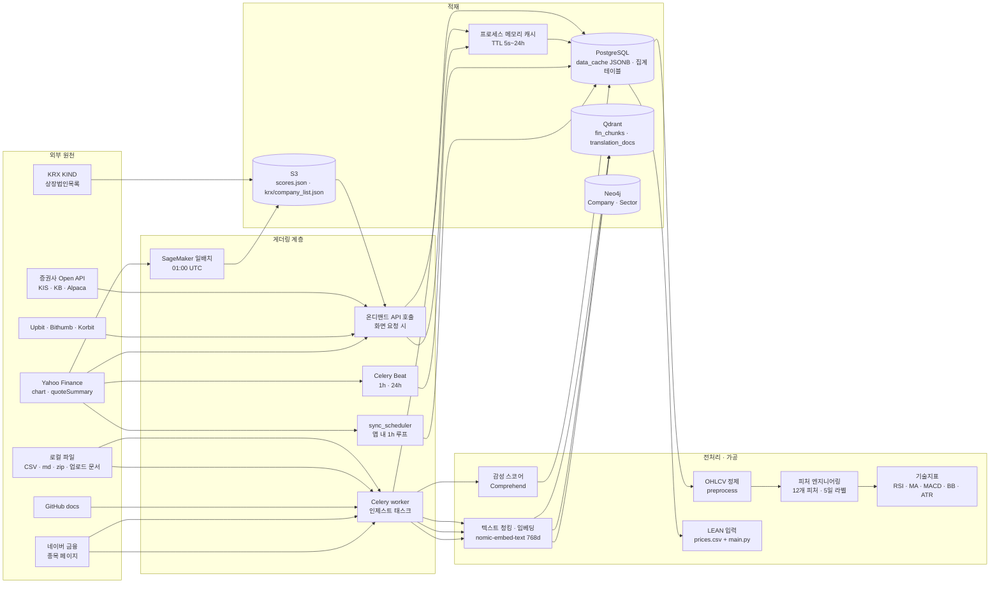

# Lumina Invest 데이터 파이프라인 설계서 — 주식 백데이터 크롤링·게더링·전처리

> 문서 상태: 현행 구현 정리 + 운용 목표안
> 기준일: 2026-09-14
> 함께 볼 문서: [onprem.md](onprem.md) (온프레미스 실행 토폴로지), [aws.md](aws.md) (AWS 실행 토폴로지)

이 문서는 시스템이 어떤 외부 데이터를 언제 어떻게 가져와서(게더링), 어디에 저장하고(적재), 어떤 규칙으로 정제·가공해(전처리) 화면·모델·백테스트에 넘기는지를 정리한다. 1~5장은 저장소의 실제 코드를 기준으로 쓴 현행 구조이고, 6~8장은 운용 단계에서 채워야 할 목표안이다.

## 1. 전체 그림



핵심 성질:

- 시세의 1차 원천은 Yahoo Finance이며 별도 유료 데이터 계약이 없다. 지연·결측·차단 가능성을 전제로 모든 소비자는 캐시를 먼저 읽는다.
- 저장소는 원시 시계열 테이블을 두지 않는다. 캔들·지표·지수는 `data_cache` 테이블의 JSONB 값으로 키별 스냅샷만 보관한다(7장에서 개선안 제시).
- 인터넷이 끊겨도 화면이 동작하도록 `is_internet_available()` 프로브와 "stale-but-valid" 캐시 읽기를 기본 정책으로 한다.

## 2. 데이터 원천 인벤토리

| 원천 | 엔드포인트 | 용도 | 호출 코드 | 갱신 주기 | 비고 |
|---|---|---|---|---|---|
| Yahoo Finance chart | `query2.finance.yahoo.com/v8/finance/chart/{symbol}` | 현재가, 일봉 OHLCV, 지수·환율·원자재·ETF | `app/services/stock.py` `_yahoo_chart`, `get_quote`, `get_candles`; `app/services/lean_backtest.py` `fetch_close_series`(period1/period2) | 온디맨드 + 1h/24h 동기화 | UA 헤더 필수. `adjclose`는 LEAN 경로만 사용 |
| Yahoo quoteSummary | `query1.finance.yahoo.com/v10/finance/quoteSummary/{symbol}` | PER/PBR/ROE/분기 실적 펀더멘털 | `stock.get_fundamentals` | 온디맨드 | crumb+cookie 발급을 30분 캐시 |
| Yahoo search | `query1.finance.yahoo.com/v1/finance/search` | 해외 종목 검색 폴백 | `routes/stocks.py` `/stocks/search` | 온디맨드 | 한글 검색어 400 오류 → KRX 로컬 엔진 우선 |
| KRX KIND 상장법인목록 | `kind.krx.co.kr/corpgeneral/corpList.do?method=download` | 종목코드↔종목명·시장 매핑, 모의투자 종목 검증, Open API `/stocks` | `app/services/krx_companies.py` | 24h (`data_cache`) | 운영 IP가 KIND에서 차단되어 S3 `krx/company_list.json` 경유 → 직접 다운로드 폴백 |
| 네이버 금융 종목 페이지 | `finance.naver.com/item/main.naver?code=` | 종목명·현재가·최근 뉴스 10건 → 감성 스코어 + RAG 문서 | `crawl.crawl_naver_stock` | 수동/비동기 태스크 | HTML 파싱(BeautifulSoup). 구조 변경에 취약 |
| Upbit | `api.upbit.com/v1/market/all`, `/ticker`, `/candles/{unit}` | KRW 마켓 목록, 현재가·등락·거래대금, 캔들 | `paper_trading.upbit_*` | 목록 1h, 시세 5s(메모리) | 인증 불필요 |
| Bithumb · Korbit | `api.bithumb.com/public/ticker/{SYM}_KRW`, `api.korbit.co.kr/v1/ticker` | 국내 거래소 가격 비교 | `paper_trading.domestic_prices` | 온디맨드 | 3초 타임아웃, 실패 시 null |
| GitHub docs | `api.github.com/repos/{owner}/{repo}/contents/{path}`, raw | 퀀트 교육 문서 RAG | `crawl.crawl_github_docs` (`CRAWL_TARGETS`: edumgt/python-quant docs) | 수동/비동기 | md 파일만 |
| 임의 URL | 사용자 입력 | RAG 문서 | `crawl.crawl_url` | 수동 | SSRF 방지 allowlist 필요(6장) |
| KIS / KB / 기타 증권사 | `openapi.koreainvestment.com:9443` (모의 29443), `developer.kbsec.com:32484` | 실계좌 시세·잔고·주문 | `app/services/brokers/*` | 온디맨드 | 사용자 자격증명, 읽기·주문 분리 |
| Alpaca Paper | `paper-api.alpaca.markets/v2` | 미국 주식 Paper 주문·계정 상태 | `quant_pipeline.alpaca_execute`, `routes/paper.py` | 온디맨드 | 환경변수 또는 사용자 입력 키 |
| AWS Comprehend | `BatchDetectSentiment` | 뉴스 헤드라인 감성 | `app/services/sentiment.py` | 크롤링 시 | 자격증명 없으면 None(선택 기능) |
| SageMaker 배치 산출물 | S3 `latest/scores.json` | 종목별 5일 방향성·수익률 예측 보조 시그널 | `quant_ai_scores.get_batch_training_scores` | 1h 캐시, 일 1회 생성 | 없어도 실시간 계산으로 대체 |
| 로컬 CSV | `DATA_DIR/09.개인 CB정보`, `10.기업 CB정보`, `12.금융상품정보/{은행수신상품,공모펀드상품}.csv` | 개인/기업 신용 통계, 금융상품 | `financial_ingest.py` | 수동/비동기 태스크 | 파일 전체 재적재(delete-then-insert) |
| 로컬 문서 | `data/raw/**/*.md` + `data/manifest.json` | 법령·가이드 RAG (버전·역할 메타) | `routes/ingest.py` `/ingest/local-docs` | 수동 | 50자 미만 건너뜀 |
| 다국어 번역 데이터 | `data/1.데이터/{Training,Validation}/{01.원천데이터,02.라벨링데이터}/*.zip` | `translation_docs` 컬렉션 | `translation_ingest.py` | 수동 | 카테고리(학술·규제·보고서·뉴스·공시)×언어(en/zh/ja/vi/id) 필터 |
| 업로드 문서 | pptx/docx/xlsx/pdf/txt | 사용자 RAG | `doc_parser.py` (`llava` VLM으로 이미지 설명) | 업로드 시 | 800단어 청크/100 겹침 |

정적 유니버스(코드 상수)는 다음 파일에서 관리한다. 바꿀 때는 세 곳을 함께 갱신해야 한다.

| 목록 | 위치 | 크기 |
|---|---|---|
| 국내 퀀트 유니버스 `QUANT_STOCKS` | `app/services/stock.py` | 31종목(섹터 분산) |
| SageMaker `UNIVERSE` | `sagemaker/train.py` | `QUANT_STOCKS`와 동일해야 함 |
| 그래프 시드 `_COMPANIES` | `app/services/graph_service.py` | 15종목 + 섹터·경쟁·공급 관계 |
| 시장 지수 `MARKET_INDICES`, 매크로 `MACRO_SYMBOLS`(9), 섹터 ETF `SECTOR_ETFS`(11), 미국 대형주 `US_STOCKS`(10) | `app/services/stock.py`, `app/services/sync_scheduler.py` | |
| 대체자산 카탈로그 `ALT_CATALOG`/`ALT_LIVE_FEEDS` | `app/services/paper_trading.py` | 11상품, 6개는 Yahoo 지연 시세 연동 |

## 3. 게더링(수집) 스케줄과 실행 주체

| 실행 주체 | 주기 | 작업 | 산출 키/테이블 | 실행 위치 |
|---|---|---|---|---|
| `sync_scheduler` (FastAPI lifespan 내 asyncio 루프) | 3,600s | 지수·매크로·섹터 ETF·미국주식 스냅샷, 유니버스 캔들(2y)·지표 워밍 | `market_indices`, `macro_indicators`, `sector_etfs`, `us_stocks`, `candles:{sym}:2y:1d`, `indicators:{sym}:2y` | API 프로세스 (온프레미스 단일 서버) |
| Celery Beat `sync.market_data` | 3,600s (`expires` 3,500s) | `sync_all(force=True)` 동일 작업 | 동일 | worker (compose `celery-beat` → `celery-worker`; AWS는 EventBridge Scheduler → ECS worker task) |
| Celery Beat `sync.stock_candles` | 86,400s | 유니버스 캔들·지표 재워밍 | 동일 | 동일 |
| 자동매매 루프 `auto_trade` | 600s | 유니버스 지표 재계산 → 시그널 → 가상/실주문 | `orders`, `portfolio`, `quant_virtual_accounts` | API 프로세스 (사용자가 start) |
| SageMaker Training Job (`infra/quant-ai`) | 매일 01:00 UTC | 유니버스 전종목 LightGBM 분류 + Ridge 회귀 재학습 | S3 `latest/scores.json` | AWS |
| Celery 태스크 `ingest.*` | 온디맨드 | CSV 인제스트, 자동 크롤링, URL 크롤링, 번역 데이터 인제스트 | Postgres 집계 테이블, Qdrant | worker |
| 화면 요청 | 온디맨드 | 시세·캔들·펀더멘털·코인·대체자산·LEAN | 메모리 TTL 캐시 + `data_cache` | API |

동시 실행 규칙:

- 두 스케줄러(앱 내 루프와 Celery Beat)가 같은 작업을 하므로 운영에서는 하나만 켠다. 권장: API 복수 인스턴스 환경에서는 앱 내 루프를 끄고 Beat(또는 EventBridge) 단일 leader만 사용한다.
- `sync_all`은 `_syncing` 플래그로 프로세스 내 중복만 막는다. 프로세스가 여러 개면 Redis lock(`SET NX EX`)으로 확장해야 한다.
- 캔들 워밍은 `Semaphore(6)`으로 Yahoo 동시 요청을 제한한다. 유니버스를 늘릴 때 이 값과 Yahoo 429 발생률을 함께 본다.

캐시 TTL 요약 (읽기 측 기준):

| 데이터 | 저장소 | TTL / max_age | 정의 위치 |
|---|---|---|---|
| 캔들 `candles:*` | `data_cache` | 6h | `stock.get_candles` |
| 지수/매크로/섹터/미국주식 | `data_cache` | 2h | `routes/stocks.py`, `routes/macro.py` |
| KRX 상장법인목록 | `data_cache` | 24h | `krx_companies` |
| 감성 `sentiment:{code}` | `data_cache` | 72h | `routes/ml.py` |
| 종목 시세(모의투자) | 메모리 | 60s | `paper_trading.resolve_stock` |
| Upbit 마켓 목록 / 티커 | 메모리 | 1h / 5s | `paper_trading` |
| 대체자산 지연 시세 | 메모리 | 60s | `paper_trading._alt_live_chart` |
| Yahoo crumb | 메모리 | 30m | `stock._get_yahoo_crumb` |
| SageMaker scores | 메모리 | 1h | `quant_ai_scores` |

## 4. 적재 스키마

### 4.1 PostgreSQL

| 테이블 | 성격 | 채우는 코드 | 비고 |
|---|---|---|---|
| `data_cache(key, data JSONB, updated_at)` | 외부 데이터 스냅샷 캐시 | `data_cache.cache_set` (upsert) | 키 1개 = 최신 값 1개. 이력 없음 |
| `personal_cb_stats`, `corporate_cb_stats` | CSV 집계(성별·연령대·기준일 / 업종·기준일별 평균) | `financial_ingest` | 원본 행 단위가 아니라 집계 결과만 저장 |
| `bank_products`, `fund_products` | 금융상품 마스터 | `financial_ingest` | |
| `crawled_docs`, `uploaded_docs` | 크롤링/업로드 문서 본문 + 메타 | `crawl._upsert_crawled_doc`, `routes/documents.py` | Qdrant와 이중 저장 |
| `portfolio`, `orders`, `paper_accounts`, `crypto_*`, `alternative_*` | 거래 상태 | 거래 라우트 | 파이프라인 산출이 아닌 트랜잭션 데이터 |
| `lean_backtest_runs` | 백테스트 실행 이력 | `routes/lean.py` | 결과 요약만 저장 |
| `audit_events` | 인제스트·주문·백테스트 감사 | `services/audit.py` | |

### 4.2 Qdrant

| 컬렉션 | 벡터 | 페이로드 | 작성자 |
|---|---|---|---|
| `fin_chunks` (`QDRANT_COLLECTION`) | `nomic-embed-text` 768d, cosine | `url`, `title`, `source`, `stock_code`, `text`, `chunk_index` | `crawl._store_qdrant`, `rag_pipeline.store_chunks`(LangChain) |
| `translation_docs` | 동일 | 카테고리·언어·문서번호 | `translation_ingest` |

두 작성 경로가 point id를 다르게 만든다(크롤링은 `hash(url-i)`, LangChain 경로는 UUID). 같은 문서를 두 경로로 넣으면 중복이 생기므로 재인제스트 전에는 `rag_pipeline.delete_chunks_by_source(source)`로 지운다.

### 4.3 Neo4j · S3

- Neo4j: `Company`/`Sector` 노드, `BELONGS_TO`/`COMPETES_WITH`/`SUPPLIES_TO` 관계를 앱 기동 시 `seed_graph()`가 idempotent하게 적재한다. 외부 원천이 아니라 코드 상수다.
- S3 (`ML_ARTIFACTS_BUCKET`): `latest/scores.json`(SageMaker), `krx/company_list.json`(KIND 우회), `code/quant_train_source.tar.gz`(학습 코드), `output/`(학습 산출물).

## 5. 전처리 규칙

### 5.1 OHLCV 정제 (`quant_pipeline.preprocess`)

1. Yahoo 응답에서 `close`가 `null`인 바(휴장·결측)는 `get_candles` 단계에서 이미 제외한다.
2. Unix timestamp → UTC `DatetimeIndex`, 시간순 정렬.
3. `open/high/low/close/volume`을 숫자로 강제 변환(`errors="coerce"`).
4. 결측은 forward fill 후 backward fill.
5. 종가 0 이하 행 제거.
6. 학습 경로는 최소 80봉, 피처 계산 후 최소 60행을 요구하며 미달 시 오류를 반환한다.

KRX 종목의 Yahoo 타임스탬프는 09:00 KST(=00:00 UTC)라 UTC 날짜 변환이 거래일과 일치한다. 미국 종목은 09:30 EST(=14:30 UTC)라 역시 같은 날짜로 떨어진다. 다른 거래소를 추가하면 이 가정을 다시 확인한다.

### 5.2 피처 엔지니어링 (`quant_pipeline.feature_engineer`, `FEATURE_COLS` 12개)

| 그룹 | 피처 | 정의 |
|---|---|---|
| 수익률 | `ret_1`, `ret_5`, `ret_20` | 종가 pct_change |
| 추세 | `ma5_ratio`, `ma20_ratio` | 종가 / 이동평균 |
| 모멘텀 | `rsi`(14), `macd`(12/26), `macd_hist` | `ta_utils` |
| 변동성 | `bb_width`, `bb_pos`(20, 2σ), `atr`(14) | 밴드 폭/중심, 밴드 내 위치, ATR |
| 수급 | `vol_ratio` | 거래량 / 20일 평균 |

라벨: 5거래일 후 수익률이 +2% 초과면 1(매수), −2% 미만이면 −1(매도), 그 외 0(관망). 피처·라벨 계산 후 `dropna()`로 워밍업 구간과 마지막 5일을 제거한다. 학습/검증은 시간순 80/20 분할이며 셔플하지 않는다. 룰 기반 시그널·백테스트는 "당일 종가로 신호 계산 → 다음 거래일 수익률에 적용"을 지켜 look-ahead를 막는다(`investment_research`, `lean_backtest._position_*`의 `shift(1)`).

SageMaker `train.py`는 같은 피처 정의를 복제해 갖고 있다. 피처를 바꾸면 두 파일을 함께 바꾸고 `scores.json` 스키마 호환을 확인한다.

### 5.3 기술지표 (`stock.get_quant_indicators`, `ta_utils`)

화면용 지표는 2년 일봉에서 RSI(14, SMA 방식), MA5/20/60, 볼린저(20, 2σ)를 계산하고 마지막 100봉만 반환한다. 리서치 경로(`investment_research.indicators`)는 RSI를 EWM 방식으로 계산하므로 두 화면의 RSI가 소폭 다를 수 있다. 통일하려면 `ta_utils.rsi(method=...)` 기본값을 한쪽으로 맞춘다.

### 5.4 LEAN 입력 (`lean_backtest`)

- 전략별 선행 구간(`ma_cross`: 장기창×2+15일, `momentum`: 돌파창×2+15일)을 검증 시작일 앞에 더해 받아온다.
- `adjclose`(배당·분할 조정) 우선, 없으면 `close`.
- `prices.csv`(`date,close`)와 커스텀 `PythonData` 리더를 포함한 `main.py`를 생성한다. LEAN이 기동 시 반드시 읽는 `market-hours`/`symbol-properties` 참조 데이터는 `app/services/lean_reference_data/`에 벤더링되어 있다.
- 결과는 `*-summary.json`의 통계와 pandas 계산치를 함께 보관한다. 두 값은 체결 시점·수수료 모델 차이로 다를 수 있으며 이는 정상이다.

### 5.5 텍스트 파이프라인

| 단계 | 크롤링(`crawl.py`) | 업로드 문서(`doc_parser.py`) | 번역 데이터 |
|---|---|---|---|
| 추출 | HTMLParser로 태그 제거 / 네이버는 CSS 셀렉터 | pptx·docx·xlsx·pdf 텍스트 + 이미지는 `llava`로 설명문 생성 | zip 내 JSON 문장 |
| 청킹 | 1,000단어, 150 겹침 | 800단어, 100 겹침 | 문장 10개 = 1청크 |
| 임베딩 | Ollama `nomic-embed-text` (provider와 무관) | 동일 | 동일 (배치 32) |
| 적재 | Qdrant `fin_chunks` + `crawled_docs` | Qdrant + `uploaded_docs` | Qdrant `translation_docs` |
| 부가 | 네이버 뉴스 헤드라인 → Comprehend 감성 → `sentiment:{code}` | | |

임베딩 모델을 바꾸면 차원이 달라지므로 새 컬렉션에 전량 재색인 후 `QDRANT_COLLECTION`을 전환한다. 기존 컬렉션과 혼용하지 않는다.

### 5.6 CSV 인제스트 (`financial_ingest.py`)

- 개인 CB: `STDT, GENDER, AGE_BAND, SCORE, SCORE_6M, PERF1, PERF2` 열을 헤더명으로 찾고 없으면 위치 기반 폴백. `1e14` 초과 값은 결측 처리. (기준일, 성별, 연령대)별 건수·평균으로 집계 저장.
- 기업 CB: `BS_DT, SIC_CD_3, WG_GB, CORP_GRAD, PERF_12M`.
- 인코딩은 UTF-8 `errors="replace"`. 전체 삭제 후 재삽입이므로 대용량 파일은 비동기 태스크(`/api/ingest/financial/async`)로 실행한다.

## 6. 품질·안전 규칙 (운용 기준)

| 항목 | 현행 | 운용 목표 |
|---|---|---|
| 외부 호출 예절 | UA 헤더, 타임아웃 3~20s, 캔들 동시성 6 | 원천별 초당 호출 상한과 백오프(429/5xx 지수 재시도) 표준화, 호출 로그 |
| 결측·이상치 | ffill/bfill, 종가≤0 제거 | 일 수익률 ±30% 초과·거래량 0 연속 등 이상치 플래그, 분할·액면변경 감지 |
| 신선도 | `cache_info`로 `updated_at` 조회 가능 | 키별 허용 지연(캔들 24h+α, 지수 2h) 초과 시 알림, 화면에 "as of" 표시 |
| 스키마 | JSONB 자유 형식 | 캐시 값에 `schema_version`, 원천, 수집 시각 메타 포함 |
| 중복 | Qdrant 두 경로 id 상이 | 문서 `source` 기준 삭제-후-적재를 표준 절차로 고정 |
| SSRF | URL 크롤링 제한 없음 | 도메인 allowlist, 사설 IP 차단, 응답 크기·리다이렉트 제한 |
| 비밀 | 브로커 키 DB 평문 | KMS/Vault 봉투 암호화, 로그 마스킹 |
| 재현성 | 유니버스·피처가 코드 상수 | 유니버스·피처·모델 버전을 릴리스 노트와 `scores.json` 메타에 기록 |
| 이중 스케줄러 | 앱 루프 + Beat | 하나만 활성화, Redis lock으로 다중 프로세스 중복 방지 |

## 7. 개선 목표안: 히스토리 저장소

현재는 JSONB 스냅샷만 있어 "어제의 캔들"을 되돌아볼 수 없고, 유니버스 밖 종목의 백테스트는 매번 Yahoo를 다시 부른다. 운용 단계에서는 다음 테이블을 추가해 수집 결과를 누적한다.

```sql
CREATE TABLE ohlcv_daily (
  symbol      varchar(20) NOT NULL,
  trade_date  date        NOT NULL,
  open numeric(18,4), high numeric(18,4), low numeric(18,4), close numeric(18,4),
  adj_close numeric(18,4), volume bigint,
  source      varchar(20) NOT NULL DEFAULT 'yahoo',
  fetched_at  timestamptz NOT NULL DEFAULT now(),
  PRIMARY KEY (symbol, trade_date)
) PARTITION BY RANGE (trade_date);

CREATE TABLE symbol_master (
  symbol varchar(20) PRIMARY KEY, code varchar(12), name varchar(100),
  market varchar(20), sector varchar(60), currency varchar(5),
  listed_at date, delisted_at date, updated_at timestamptz DEFAULT now()
);

CREATE TABLE fetch_log (
  id bigserial PRIMARY KEY, source varchar(30), target varchar(100),
  status int, rows int, duration_ms int, error text, fetched_at timestamptz DEFAULT now()
);
```

적재 규칙: `INSERT ... ON CONFLICT (symbol, trade_date) DO UPDATE`로 멱등하게 쓰고, 최신 2~3거래일은 정정 가능성 때문에 매 동기화마다 덮어쓴다. `get_candles`는 먼저 이 테이블을 읽고 마지막 거래일 이후 구간만 원천에서 증분 수집한다. 연 단위 파티션과 `symbol` 인덱스로 5년×전종목(약 2,700종목×1,250일 ≈ 340만 행)도 단일 PostgreSQL에서 충분하다.

백필 절차:

1. `symbol_master`를 KIND 목록으로 채운다.
2. 종목별로 Yahoo `range=10y`를 한 번 받아 `ohlcv_daily`에 적재한다(동시성 4~6, 429 시 60초 대기).
3. 실패 종목은 `fetch_log`에 남기고 다음 배치에서 재시도한다.
4. 완료 후 캔들 캐시 키를 무효화하고 지표 워밍을 1회 실행한다.

## 8. 실행 환경별 매핑

| 단계 | 온프레미스 (onprem.md) | AWS (aws.md) |
|---|---|---|
| 주기 수집 | Celery Beat 1 replica + worker (K8s Deployment/KEDA) | EventBridge Scheduler → ECS worker task (`lumina-hourly-sync`, `lumina-daily-candles`) |
| 크롤링·인제스트 | Celery worker, 사내 프록시로 egress 제한 | ECS worker 또는 `lumina-crawl-service` Lambda(API GW 300s 제한 내 작업만) |
| 재학습 | K8s CronJob (CPU) 또는 GPU 노드 | SageMaker Training Job (Lambda 트리거, 01:00 UTC) → S3 |
| 감성분석 | 로컬 모델(Ollama 분류 프롬프트)로 대체 가능 | Comprehend |
| KRX 목록 | KIND 직접 다운로드(차단 없음) | S3 경유(KIND가 AWS IP 차단) |
| 캐시·히스토리 | PostgreSQL HA + 백업 | RDS PostgreSQL Multi-AZ, 스냅샷 |
| 벡터 | Qdrant StatefulSet | Qdrant EC2/Cloud, 스냅샷 S3 |
| LEAN 백테스트 | 격리 Job runner (docker.sock 금지) | AWS Batch / ECS on EC2, 입력·결과 S3 |
| 외부 egress 목록 | Yahoo, KIND, 네이버, Upbit/Bithumb/Korbit, GitHub, 증권사 API, Alpaca | 동일 + Bedrock/SageMaker/Comprehend VPC endpoint |

## 9. 운영 체크리스트

- [ ] 스케줄러는 하나만 활성(앱 루프 또는 Beat/EventBridge)이며 다중 프로세스 lock이 있다.
- [ ] 캐시 키별 신선도 경보 임계값이 정의되어 있고 대시보드에 "as of"가 보인다.
- [ ] `QUANT_STOCKS`·`sagemaker/train.py UNIVERSE`·그래프 시드가 동일 릴리스에서 갱신된다.
- [ ] 임베딩 모델·차원·컬렉션 이름이 릴리스 노트에 고정되어 있다.
- [ ] URL 크롤링 allowlist와 응답 크기 제한이 적용되어 있다.
- [ ] 원천별 호출량·429·실패율이 `fetch_log`(또는 메트릭)로 수집된다.
- [ ] 히스토리 테이블 백필과 증분 수집이 검증되었고 재실행이 멱등하다.
- [ ] Yahoo 장애 시 화면이 캐시로 동작하는지 오프라인 모드 시험을 했다.

## 10. 관련 파일

- 시세·캔들·지표: [`app/services/stock.py`](app/services/stock.py)
- 동기화: [`app/services/sync_scheduler.py`](app/services/sync_scheduler.py), [`app/tasks/sync_tasks.py`](app/tasks/sync_tasks.py), [`app/celery_app.py`](app/celery_app.py)
- 캐시: [`app/services/data_cache.py`](app/services/data_cache.py)
- KRX 목록: [`app/services/krx_companies.py`](app/services/krx_companies.py)
- 퀀트 전처리·학습·백테스트: [`app/services/quant_pipeline.py`](app/services/quant_pipeline.py), [`app/services/ta_utils.py`](app/services/ta_utils.py), [`app/services/investment_research.py`](app/services/investment_research.py)
- 크롤링·RAG: [`app/services/crawl.py`](app/services/crawl.py), [`app/services/rag_pipeline.py`](app/services/rag_pipeline.py), [`app/services/doc_parser.py`](app/services/doc_parser.py), [`app/services/translation_ingest.py`](app/services/translation_ingest.py)
- CSV 인제스트: [`app/services/financial_ingest.py`](app/services/financial_ingest.py), [`app/tasks/ingest_tasks.py`](app/tasks/ingest_tasks.py)
- 모의투자 시세: [`app/services/paper_trading.py`](app/services/paper_trading.py)
- LEAN: [`app/services/lean_backtest.py`](app/services/lean_backtest.py)
- 배치 학습: [`sagemaker/train.py`](sagemaker/train.py), [`infra/quant-ai/`](infra/quant-ai/), [`app/services/quant_ai_scores.py`](app/services/quant_ai_scores.py)
